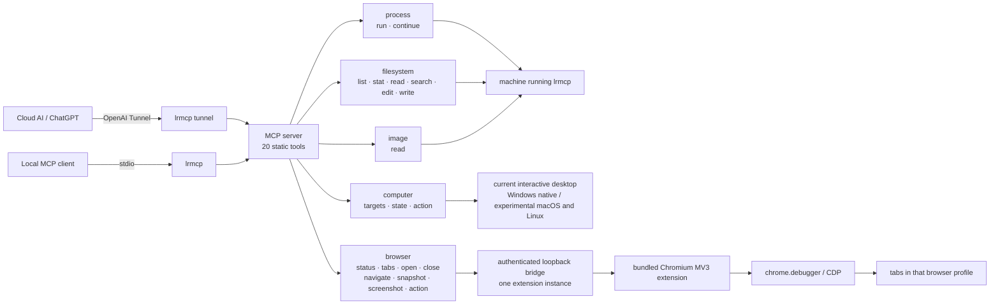

# Local Runtime MCP

`local-runtime-mcp` gives an MCP client direct access to the machine on which `lrmcp` is running. “Local” is relative to that process: the same binary can run on a laptop, workstation, VM, or remote server, and each running instance represents exactly one machine.

The executable has one capability API—MCP. Its small command line selects a transport, prepares the browser extension, or prints diagnostics; it does not duplicate the MCP tools.

## Architecture



There is no generic core layer, capability registry, dynamic plug-in system, host router, workspace model, root sandbox, or compatibility layer. The five domains are ordinary compile-time Go packages registered directly on one MCP server. Transport changes how a client reaches that server; it does not change the tools.

## The 20 MCP tools

### Process (2)

| Tool | Function |
| --- | --- |
| `process_run` | Start an installed executable directly—never through implicit shell parsing—with an argument array, working directory, environment overrides, initial stdin, lifetime timeout, retained-output bounds, and initial wait. A completed process returns its exit result; a longer process returns a session ID. |
| `process_continue` | Read incremental stdout/stderr, write or close stdin, wait again, or terminate the complete process tree associated with a session. Completed abandoned sessions expire automatically. |

Windows processes are placed in a kill-on-close Job Object. Unix processes run in their own process group. Cancellation, timeout, termination, and server shutdown therefore apply to the process tree, not only its root process.

### Filesystem (6)

Paths may be absolute or relative to the `lrmcp` process working directory. Returned paths are absolute. There is deliberately no workspace root or artificial path sandbox.

| Tool | Function |
| --- | --- |
| `filesystem_list` | Walk a directory without following symlinks, with maximum depth, entry count, and hidden-name controls. Returns explicit `truncated` and `skipped` signals. |
| `filesystem_stat` | Inspect a path without following its final symlink. Returns type, size, time, MIME information, symlink target, and optional SHA-256. |
| `filesystem_read_text` | Read complete UTF-8 lines from a one-based starting line, bounded by line count and bytes. Returns the next line cursor, truncation state, and optional full-file SHA-256. Images and arbitrary binary data do not pass through this tool. |
| `filesystem_search_text` | Search one file or a directory tree using literal text or a Go regular expression, with case/hidden controls and a result bound. Binary, oversized, and unreadable files are counted as skipped. |
| `filesystem_edit_text` | Apply an ordered batch of exact replacements in memory and commit once. Ambiguous matches fail unless `replace_all` is explicit; if any edit fails, none are written. An expected SHA-256 provides an optional optimistic concurrency check. |
| `filesystem_write_text` | Atomically create or replace a complete UTF-8 file. Supports create-only and optional expected-SHA-256 modes and returns the new hash. |

### Image (1)

| Tool | Function |
| --- | --- |
| `image_read` | Return a PNG, JPEG, GIF, or WebP path as native MCP image content plus MIME type and dimensions. Both encoded bytes and decoded pixel count are bounded independently. |

The separate image domain is intentional: an image is model-visible native image content, not text encoded into a filesystem response.

### Computer (3)

| Tool | Function |
| --- | --- |
| `computer_targets` | List currently open top-level windows. It does not list installed applications; launching a program belongs to `process_run`. |
| `computer_state` | Capture the complete virtual desktop or one selected window as native PNG and return a `state_id`, dimensions, origin, cursor position, and optional visible native-control references. |
| `computer_action` | Activate a window; move, click, double-click, drag, type, replace focused text, press a key combination, or scroll. It can target state-relative coordinates or a native-control reference. |

Coordinates are relative to the image returned by `computer_state`. Supplying its `state_id` rejects an action when the selected bounds changed, preventing clicks based on stale geometry. A control reference always requires its originating state.

Windows uses native Win32 window discovery, capture, keyboard, and pointer input. Window capture reflects the pixels currently visible on the interactive desktop; it does not claim to see through an occluding window. The optional native-control tree covers HWND controls, not every UI Automation provider. `lrmcp` must run in the signed-in interactive Windows session.

The macOS (`screencapture` + `cliclick`) and Linux (`gnome-screenshot`/`scrot` + `xdotool`) command backends currently provide experimental desktop-wide state and actions. They report window targeting as unsupported instead of pretending to implement it.

### Browser (8)

| Tool | Function |
| --- | --- |
| `browser_status` | Report configuration, connection freshness, browser identity, and extension version. |
| `browser_tabs` | List controllable tabs in the profile containing the extension. |
| `browser_open` | Open a new tab and wait for loading to finish. |
| `browser_close` | Close a tab. |
| `browser_navigate` | Navigate an existing tab and wait for loading to finish. |
| `browser_snapshot` | Return bounded visible text plus versioned references, accessible names, values, and rectangles for interactive elements. Traversal includes open shadow roots and accessible same-origin frames. |
| `browser_screenshot` | Capture a viewport, complete scrollable page, or page clip as native PNG. A viewport capture returns a `screenshot_id` for coordinate actions. |
| `browser_action` | Click, double-click, hover, drag, type, replace text, press keys, scroll, select, check, upload files, handle dialogs, navigate history, or evaluate JavaScript. Targets may be a current snapshot reference, a top-document CSS selector, or current viewport screenshot coordinates. |

Browser control has exactly one implementation path: the bundled Manifest V3 Chromium extension. The extension uses `chrome.debugger` as its CDP transport and requests `debugger`, `tabs`, and `storage`, plus access only to the loopback bridge. The bridge binds to loopback, uses a generated bearer token, and accepts one extension instance at a time.

Snapshot references contain the snapshot ID and fail after a newer snapshot replaces them. Coordinate actions require the exact current viewport screenshot ID and reject out-of-bounds or stale coordinates. CSS selectors remain an explicit escape hatch. `evaluate` is intentionally powerful because this project exposes direct machine control rather than a security sandbox.

## Build

```powershell
go build -o lrmcp.exe ./cmd/lrmcp
```

## Browser setup

The only persistent configuration is for the optional browser bridge:

```yaml
browser:
  listen: 127.0.0.1:9315
  token: ${LRMCP_BROWSER_TOKEN}
```

Generate a token, save the configuration, extract the bundled extension, and package the bridge settings in one command:

```powershell
lrmcp browser-setup
```

The command prints the extension directory but never the token. In `edge://extensions` or `chrome://extensions`, enable Developer mode, choose **Load unpacked**, and select that directory. Run setup again after upgrading the binary, then reload the unpacked extension so its service worker uses the new code.

## Connect

Run with no subcommand for stdio MCP:

```powershell
lrmcp
lrmcp --config C:\path\to\config.yaml
```

For a ChatGPT custom connector, obtain its OpenAI Tunnel ID and API key, keep the key in an environment variable, and run:

```powershell
$env:CONTROL_PLANE_TUNNEL_ID = "..."
$env:CONTROL_PLANE_API_KEY = "..."
lrmcp tunnel
```

Each additional machine runs its own `lrmcp` process and has its own connector/tunnel identity. This project does not aggregate machines or make the model choose a host inside one MCP server.

## CLI surface

```text
lrmcp [--config PATH]       # MCP over stdio
lrmcp tunnel [flags]        # MCP over OpenAI Tunnel
lrmcp browser-setup [flags] # extract/configure the bundled browser extension
lrmcp version
lrmcp help
```

The CLI remains because a binary needs lifecycle and transport commands. It is not a second capability API and is not a replacement for SSH or native shell commands.

## Development

```powershell
go test ./...
go test -race ./...
go vet ./...
go build ./cmd/lrmcp
```

Version 4.0 is intentionally breaking. It adds process sessions, bounded/hash-aware filesystem operations, stateful browser references and coordinate control, explicit computer targets/state/actions, and image pixel bounds. It removes `computer_screenshot`, the old single-edit payload, old browser `type`/`key` action names, and all compatibility shims.

## License

[MIT](LICENSE)
