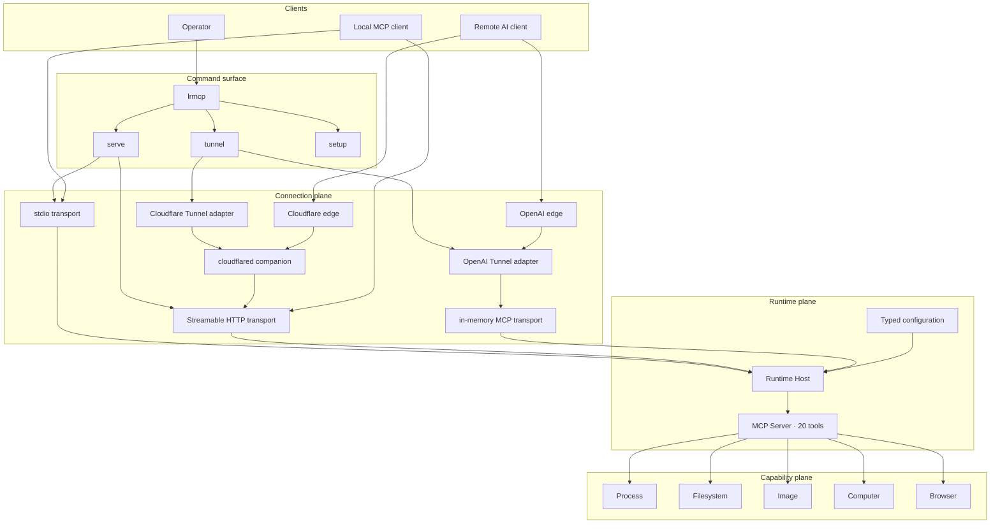
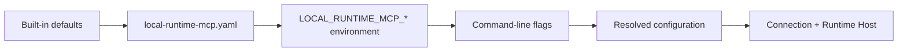
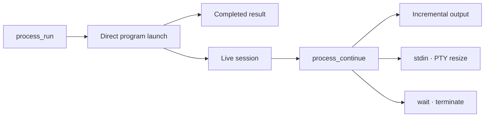
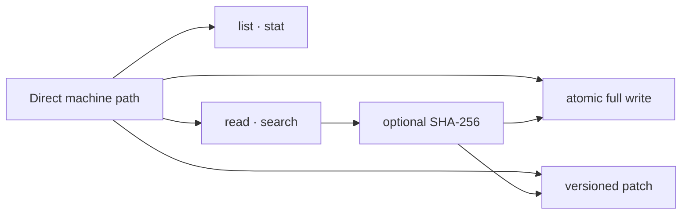
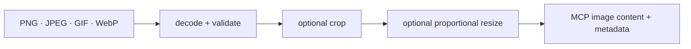
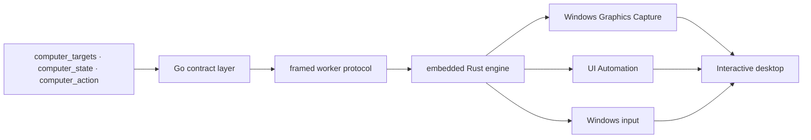
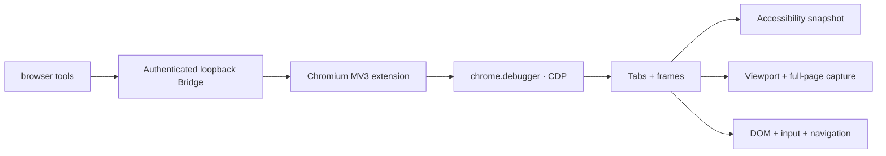

# Local Runtime MCP

[](https://github.com/hicancan/local-runtime-mcp/actions/workflows/ci.yml)
[](https://github.com/hicancan/local-runtime-mcp/releases/latest)
[](LICENSE)

**English** · [简体中文](README.zh-CN.md)

Local Runtime MCP gives AI clients direct, native, multimodal access to the machine running `lrmcp`. One portable runtime exposes 20 MCP tools across processes, files, images, the Windows desktop, and Chromium.

The same capability server works locally over stdio, on loopback over Streamable HTTP, through OpenAI Secure MCP Tunnel, or behind a managed Cloudflare Tunnel. A Windows release directory can live on a fixed drive or removable storage and carries its executable, configuration, browser integration, and tunnel companion together.

## Highlights

- **Five orthogonal capability domains**: process, filesystem, image, computer, and browser.
- **One stable MCP surface**: every connection mode exposes the same 20 tools and state semantics.
- **Native multimodal results**: images, browser captures, and desktop captures are returned as MCP image content.
- **State-aware interaction**: browser references, screenshots, and desktop observations are versioned before actions use them.
- **Portable operation**: `local-runtime-mcp.yaml` lives beside the executable and moves with the runtime directory.
- **Purpose-built implementation boundaries**: Go hosts MCP and machine services, Rust implements the Windows computer engine, and TypeScript implements the Chromium extension.

## Architecture

Local Runtime MCP separates two independent questions:

1. **How does an MCP client reach this runtime?** — connection plane.
2. **What can the runtime do on this machine?** — capability plane.

Every command selects one connection mode, starts one Runtime Host, and publishes the same MCP Server.



### Command surface

The command hierarchy mirrors the architecture:

```text
lrmcp
├── serve
│   ├── stdio
│   └── http
├── tunnel
│   ├── openai
│   └── cloudflare
├── setup
│   └── browser
├── version
└── help
```

| Command | MCP path | Authentication | Typical use |
| --- | --- | --- | --- |
| `lrmcp serve stdio` | Standard MCP stdio | Process environment and host access | Local MCP hosts and developer tools |
| `lrmcp serve http` | Standard MCP Streamable HTTP on loopback | Static Bearer token | Local integration and reverse-proxy origin |
| `lrmcp tunnel openai` | Embedded OpenAI Tunnel adapter and in-memory MCP transport | OpenAI tunnel ID and API key | ChatGPT and supported OpenAI clients |
| `lrmcp tunnel cloudflare` | `cloudflared` companion to loopback Streamable HTTP | Cloudflare tunnel token plus MCP Bearer token | Stable public hostname backed by this machine |
| `lrmcp setup browser` | Extract and configure the Chromium extension | Generated loopback bridge token | Browser capability setup |

`serve` selects a standard MCP transport. `tunnel` selects a reachability provider. OpenAI uses its embeddable tunnel client directly; Cloudflare uses its maintained `cloudflared` companion and forwards to the HTTP transport. Each adapter follows the provider's native integration model while preserving one public command structure.

### Runtime Host

The Runtime Host owns the browser Bridge, Computer Controller, process sessions, and MCP Server. Connection adapters own message delivery and process lifetime. Closing `lrmcp` closes the selected connection and the machine runtime together.

### Configuration flow

All entry points resolve one typed configuration object with the same precedence:



The configuration path is always `<directory containing lrmcp>/local-runtime-mcp.yaml`. This gives a copied runtime directory the same connection and browser identity on another machine.

## Capability domains

### Process



`process_run` starts an executable directly with an argument array, working directory, environment overrides, initial stdin, timeout, output limits, and either pipe or PTY I/O. Short commands return their final result; longer commands return a session ID. `process_continue` reads incremental output, writes input, closes stdin, resizes a PTY, waits, or terminates the complete process tree.

### Filesystem



Filesystem tools accept absolute paths and paths relative to the runtime working directory. Reads, searches, and traversal have explicit result limits. Full writes commit atomically. Patch operations combine an expected SHA-256 with uniquely anchored hunks, giving agents optimistic concurrency control without introducing a separate workspace model.

| Tool | Operation |
| --- | --- |
| `filesystem_list` | Bounded directory traversal |
| `filesystem_stat` | Metadata and optional SHA-256 |
| `filesystem_read_text` | Bounded UTF-8 line ranges |
| `filesystem_search_text` | Literal or Go-regexp search |
| `filesystem_write_text` | Atomic create or complete replacement |
| `filesystem_patch_text` | Atomic, version-checked contextual patch |

### Image



`image_read` turns a machine path into native MCP image content. It validates encoded size and pixel count, supports cropping and proportional resizing, and returns media type, dimensions, and source metadata with the image.

### Computer



The Windows Computer domain combines pixels, semantic UI elements, and native input into one observation/action loop:

- `computer_targets` lists validated top-level window identities.
- `computer_state` captures the desktop or active target and returns a state ID plus bounded UI Automation references.
- `computer_action` activates a target or performs `move`, `click`, `double_click`, `drag`, `type_text`, `set_value`, `press_key`, or `scroll`.

Activation and physical input advance the state epoch. Subsequent actions continue from a fresh `computer_state`, keeping coordinates and semantic references tied to the observation that produced them. The Rust worker owns capture, UI Automation, DPI and coordinate transforms, foreground validation, and input routing; Go owns the public MCP contract and worker lifecycle.

### Browser



The Browser domain controls the Chromium profile chosen by the operator. The extension connects to the authenticated loopback Bridge and uses `chrome.debugger` with Chrome DevTools Protocol, preserving the profile's sessions, tabs, downloads, and browser permissions.

| Tool | Operation |
| --- | --- |
| `browser_status` | Bridge and extension health |
| `browser_tabs` | List attached browser tabs |
| `browser_open` | Open a tab |
| `browser_close` | Close a tab |
| `browser_navigate` | URL, back, forward, or reload |
| `browser_snapshot` | Bounded visible text and versioned element references across frames |
| `browser_screenshot` | Viewport, full-page, or clipped PNG capture |
| `browser_action` | Click, double-click, hover, drag, type, set value, press key, scroll, select, check, upload files, handle dialogs, or evaluate JavaScript |

Snapshots produce versioned element references. Viewport screenshots produce versioned coordinate spaces. Actions explicitly identify one of those observations, so page changes cannot silently reuse stale targets.

## Tool surface

| Domain | Tools | Count |
| --- | --- | ---: |
| Process | `process_run`, `process_continue` | 2 |
| Filesystem | `filesystem_list`, `filesystem_stat`, `filesystem_read_text`, `filesystem_search_text`, `filesystem_write_text`, `filesystem_patch_text` | 6 |
| Image | `image_read` | 1 |
| Computer | `computer_targets`, `computer_state`, `computer_action` | 3 |
| Browser | `browser_status`, `browser_tabs`, `browser_open`, `browser_close`, `browser_navigate`, `browser_snapshot`, `browser_screenshot`, `browser_action` | 8 |
| **Total** |  | **20** |

## Installation

Download a platform archive from [Releases](https://github.com/hicancan/local-runtime-mcp/releases/latest) and extract it into its own directory.

The Windows archive contains:

```text
local-runtime-mcp/
├── lrmcp.exe
├── cloudflared.exe
├── config.example.yaml
├── README.md
├── README.zh-CN.md
├── LICENSE
├── THIRD_PARTY_NOTICES.md
└── cloudflared-LICENSE
```

Copy `config.example.yaml` to `local-runtime-mcp.yaml` and fill the sections used by your selected connection mode:

```yaml
browser:
  listen: 127.0.0.1:9315
  token: "replace-with-a-random-token-of-at-least-32-characters"

openai:
  tunnel_id: "replace-with-your-openai-tunnel-id"
  api_key: "replace-with-your-openai-tunnel-api-key"

http:
  listen: 127.0.0.1:9316
  public_host: mcp.example.com
  bearer_token: "replace-with-a-random-token-of-at-least-32-characters"

cloudflare:
  tunnel_token: "replace-with-your-cloudflare-managed-tunnel-token"
```

The configuration file contains connection credentials. Store the runtime directory with the same care as any other credential-bearing application directory.

### Browser setup

Run:

```powershell
./lrmcp.exe setup browser
```

The command creates a browser token when needed, saves it in the adjacent YAML file, and extracts the extension to `browser-extension` beside the executable. Open `edge://extensions` or `chrome://extensions`, enable Developer mode, choose **Load unpacked**, and select that directory.

### Local stdio

A typical MCP client configuration is:

```json
{
  "mcpServers": {
    "local-runtime-mcp": {
      "command": "C:\\Tools\\local-runtime-mcp\\lrmcp.exe",
      "args": ["serve", "stdio"]
    }
  }
}
```

### OpenAI Tunnel

Place the tunnel credentials in the `openai` section and run:

```powershell
./lrmcp.exe tunnel openai
```

See the [OpenAI Secure MCP Tunnel guide](https://developers.openai.com/api/docs/guides/secure-mcp-tunnels) for tunnel creation and supported clients.

### Streamable HTTP

Place an HTTP Bearer token in the `http` section and run:

```powershell
./lrmcp.exe serve http
```

The MCP endpoint is `http://127.0.0.1:9316/mcp` by default. The listener remains on loopback and is suitable as the origin for a local reverse proxy.

### Cloudflare Tunnel

Create a remotely managed Cloudflare Tunnel, route its hostname to `http://127.0.0.1:9316`, fill `http.public_host`, `http.bearer_token`, and `cloudflare.tunnel_token`, then run:

```powershell
./lrmcp.exe tunnel cloudflare
```

Release archives include the pinned `cloudflared` companion. The public endpoint is `https://<public_host>/mcp` and accepts the configured HTTP Bearer token.

## Environment and command-line overrides

Portable YAML is the normal operating path. Automation can override individual fields:

| Environment variable | YAML field |
| --- | --- |
| `LOCAL_RUNTIME_MCP_BROWSER_LISTEN` | `browser.listen` |
| `LOCAL_RUNTIME_MCP_BROWSER_TOKEN` | `browser.token` |
| `LOCAL_RUNTIME_MCP_OPENAI_TUNNEL_ID` | `openai.tunnel_id` |
| `LOCAL_RUNTIME_MCP_OPENAI_API_KEY` | `openai.api_key` |
| `LOCAL_RUNTIME_MCP_HTTP_LISTEN` | `http.listen` |
| `LOCAL_RUNTIME_MCP_HTTP_PUBLIC_HOST` | `http.public_host` |
| `LOCAL_RUNTIME_MCP_HTTP_BEARER_TOKEN` | `http.bearer_token` |
| `LOCAL_RUNTIME_MCP_CLOUDFLARE_TUNNEL_TOKEN` | `cloudflare.tunnel_token` |
| `LOCAL_RUNTIME_MCP_CLOUDFLARED` | `cloudflare.binary` |

Run `lrmcp help` for the corresponding command-line flags.

## Build and test

Requirements: Go 1.27, Node.js 24, and the stable Rust MSVC toolchain for the Windows computer engine.

```powershell
Push-Location browser-extension
npm ci
npm run build
Pop-Location
./scripts/build-native.ps1
go test ./...
go vet ./...
go build ./cmd/lrmcp
```

CI builds and tests Windows, Linux, and macOS. Windows CI also runs the Chromium extension end-to-end suite and Rust formatting and lint checks.

## License

Local Runtime MCP is licensed under [GNU AGPL v3.0 only](LICENSE). Release archives include the separately licensed `cloudflared` companion; attribution and license details are in [THIRD_PARTY_NOTICES.md](THIRD_PARTY_NOTICES.md).
