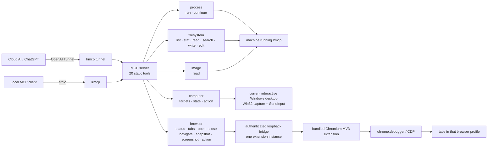

# Local Runtime MCP

`local-runtime-mcp` exposes the machine running `lrmcp` to an MCP client. “Local” is relative to the process: the same binary can run on a laptop, workstation, VM, or server, and one running instance represents exactly one machine.

There is one executable, one MCP server, and five public capability domains. The CLI exists only to start a transport and prepare the browser extension; it is not a second automation API.

## Architecture



The boundaries are concrete:

- `process` owns executing programs and process sessions.
- `filesystem` owns path-addressed text and metadata.
- `image` is the native image-content boundary; it does not duplicate file operations.
- `computer` owns physical desktop pixels and input.
- `browser` owns semantic web-page state and browser actions through one extension path.
- stdio and OpenAI Tunnel are transports to the same MCP server, not capability implementations.

There is deliberately no generic core layer, capability registry, dynamic plug-in system, host router, workspace model, root sandbox, or compatibility layer. The five domains are compile-time Go packages registered directly on one server.

## MCP tools

### Process (2)

| Tool | Contract |
| --- | --- |
| `process_run` | Starts an executable directly with `program`, an argument array, working directory, environment overrides, initial stdin, lifetime timeout, retained-output bounds, and initial wait. It never inserts an implicit shell. A completed process returns its exit result; a running process returns a session ID. |
| `process_continue` | Reads incremental stdout/stderr, writes or closes stdin, waits again, or terminates the complete process tree for a session. |

On Windows, child processes enter a kill-on-close Job Object. On Unix, they run in a process group. Cancellation, timeout, explicit termination, and server shutdown therefore apply to the process tree rather than only its root.

### Filesystem (6)

Paths may be absolute or relative to the `lrmcp` working directory. Returned paths are absolute. There is no invented workspace root.

| Tool | Contract |
| --- | --- |
| `filesystem_list` | Walks a directory without following symbolic links. Depth, entry count, and hidden names are explicit and bounded; truncation and skipped entries are reported. |
| `filesystem_stat` | Inspects a path without following its final symbolic link. Returns type, size, timestamps, MIME information, link target, and optional SHA-256. |
| `filesystem_read_text` | Reads complete UTF-8 lines from a one-based line cursor, bounded independently by line count and bytes. Returns the next cursor, truncation state, and optional full-file SHA-256. |
| `filesystem_search_text` | Searches a file or tree with literal text or a Go regular expression. Case, hidden names, and result count are explicit. Binary, oversized, and unreadable files are counted as skipped. |
| `filesystem_write_text` | Atomically creates or replaces a complete UTF-8 file. Supports create-only, expected-SHA-256, and explicit `create_parents`; missing parents fail by default. |
| `filesystem_edit_text` | Applies an ordered batch of exact replacements in memory and commits once. Ambiguous matches fail unless `replace_all` is explicit; any failed edit aborts the whole batch. Optional expected-SHA-256 provides optimistic concurrency. |

`filesystem_write_text` and `filesystem_edit_text` reject a final symbolic-link target. This prevents a mutation request for one path from silently replacing the file named by that link. Images and arbitrary binary data never pass through the text reader.

### Image (1)

| Tool | Contract |
| --- | --- |
| `image_read` | Returns a PNG, JPEG, GIF, or WebP path as native MCP image content plus MIME type and dimensions. Encoded bytes and decoded pixel count have separate bounds. |

This domain exists because model-visible image content is a different modality from filesystem text, not because it owns a second path namespace.

### Computer (3)

| Tool | Contract |
| --- | --- |
| `computer_targets` | Lists open top-level windows. It does not list installed applications; program launch belongs to `process_run`. |
| `computer_state` | Captures the complete virtual desktop (`window_id: 0`) or one currently foreground window as native PNG. Returns a `state_id`, target identity, bounds, image origin, and cursor position. |
| `computer_action` | Activates a window, or moves, clicks, double-clicks, drags, types, replaces focused text, presses a key combination, or scrolls against an exact prior state. |

Computer control has strict physical-state invariants:

1. `activate` requires `window_id`, does not accept `state_id`, and invalidates every prior state.
2. Every other action requires `state_id` from `computer_state`.
3. A selected window must already be foreground when its state is captured. The implementation never auto-activates a different window and then reuses old geometry.
4. The state binds the target window handle, process, foreground window, bounds, and global action epoch.
5. Every successful physical action invalidates all earlier states. Observe again before acting again.
6. Coordinates are relative to the returned image and are translated only after bounds validation.

Windows is the only implemented Computer backend in v5. It uses native top-level window discovery, current-desktop pixel capture, per-monitor-v2 DPI awareness, and `SendInput`. Selected-window capture is an honest crop of pixels currently visible on the interactive desktop; a non-foreground window is rejected, and the implementation does not claim to see through occlusion. It also does not claim hidden-window capture or semantic UI Automation support.

On macOS and Linux the three tools remain discoverable but return a clear unsupported-platform error. The former shell-command imitations were removed because partial behavior is worse than an explicit boundary.

### Browser (8)

| Tool | Contract |
| --- | --- |
| `browser_status` | Reports bridge configuration, connection freshness, browser identity, and extension version. |
| `browser_tabs` | Lists controllable tabs in the browser profile containing the extension, excluding browser-internal and extension pages. |
| `browser_open` | Opens a new tab and waits for loading to complete. |
| `browser_close` | Closes a tab by ID. |
| `browser_navigate` | Performs one explicit navigation mode: `url`, `back`, `forward`, or `reload`, then waits for loading. |
| `browser_snapshot` | Returns bounded visible text and interactive elements with accessible names, values, rectangles, and versioned refs. It traverses open shadow roots and accessible same-origin frames. |
| `browser_screenshot` | Returns a viewport, full-page, or page-clip native PNG. A viewport capture also returns a `screenshot_id` for coordinate targeting. |
| `browser_action` | Performs `click`, `double_click`, `hover`, `drag`, `type_text`, `set_value`, `press_key`, `scroll`, `select`, `check`, `upload_files`, `handle_dialog`, or `evaluate`. |

Browser control has exactly one implementation path: the bundled Manifest V3 Chromium extension. It uses `chrome.debugger` as the CDP transport and talks only to the authenticated loopback bridge. This grants semantic DOM control and native page screenshots inside the user’s real browser profile; it is not a second Computer backend.

Snapshot and viewport-screenshot observations share one per-tab page epoch:

- Several snapshots may coexist in the same unchanged epoch; up to eight ref maps are retained.
- A ref identifies one element in one retained snapshot. A screenshot ID identifies one exact viewport capture.
- Navigation, tab loading, or any successful browser action invalidates the page epoch and every observation derived from it.
- Ref actions, screenshot-coordinate actions, and CSS-selector actions are distinct target modes. Operations requiring a target accept exactly one mode.
- CSS selectors and `evaluate` are deliberate escape hatches for direct control, not alternate browser backends.

The bridge binds to loopback, authenticates every request with a generated bearer token, enforces the exact extension version, accepts one extension instance at a time, and times out abandoned calls.

## Install

Download the archive for your platform from [Releases](https://github.com/hicancan/local-runtime-mcp/releases), extract `lrmcp`/`lrmcp.exe`, and optionally add its directory to `PATH`.

Or build it:

```powershell
go build -o lrmcp.exe ./cmd/lrmcp
```

Verify the installed binary:

```powershell
lrmcp version
```

## Browser setup

The only persistent configuration is for the optional browser bridge:

```yaml
browser:
  listen: 127.0.0.1:9315
  token: ${LRMCP_BROWSER_TOKEN}
```

Generate a token when needed, save the configuration, extract the extension embedded in the binary, and package its loopback settings with:

```powershell
lrmcp browser-setup
```

The command prints the extension directory and config path but never the token. In `edge://extensions` or `chrome://extensions`, enable Developer mode, choose **Load unpacked**, and select that directory. After upgrading `lrmcp`, run setup again and reload the unpacked extension so the binary and extension versions stay identical.

## Connect

With no subcommand, `lrmcp` serves MCP over stdio:

```powershell
lrmcp
lrmcp --config C:\path\to\config.yaml
```

For a ChatGPT custom connector, set its OpenAI Tunnel credentials in the process environment and run:

```powershell
$env:CONTROL_PLANE_TUNNEL_ID = "..."
$env:CONTROL_PLANE_API_KEY = "..."
lrmcp tunnel
```

Each machine runs its own `lrmcp` and has its own connector/tunnel identity. The project does not aggregate machines or make the model choose a host inside one MCP server.

## CLI surface

```text
lrmcp [--config PATH]       MCP over stdio
lrmcp tunnel [flags]        MCP over OpenAI Tunnel
lrmcp browser-setup [flags] extract/configure the bundled browser extension
lrmcp version
lrmcp help
```

The CLI is only a lifecycle and transport surface. Once a human or script already has a native shell on a machine, `lrmcp` is not intended to replace that shell or SSH.

## Development

```powershell
go test ./...
go vet ./...
go build ./cmd/lrmcp
```

The browser extension has an opt-in, isolated real-Edge test:

```powershell
$env:LRMCP_BROWSER_E2E = "1"
go test ./internal/browser -run TestEdgeExtensionEndToEnd -v
```

The Windows physical-input smoke test is also opt-in because it moves the real pointer:

```powershell
$env:LRMCP_DESKTOP_SMOKE = "1"
go test ./internal/computer -run TestWindowsDesktopSmoke -v
```

CI runs unit tests on Windows, Linux, and macOS, the race detector on Linux, the isolated Edge extension test on Windows, `go vet`, and a complete build.

## v5 breaking changes

- Computer actions now require exact state (except activation), every action invalidates earlier state, fake HWND accessibility was removed, and non-Windows imitation backends were deleted.
- Browser history moved from `browser_action` to explicit `browser_navigate` modes. Snapshot and viewport-screenshot IDs now share a page epoch, and action target validation is exclusive.
- Filesystem mutations reject final symlinks. Parent-directory creation is explicit and disabled by default.
- All old compatibility fields and legacy semantics were removed rather than shimmed.

## License

[MIT](LICENSE)
