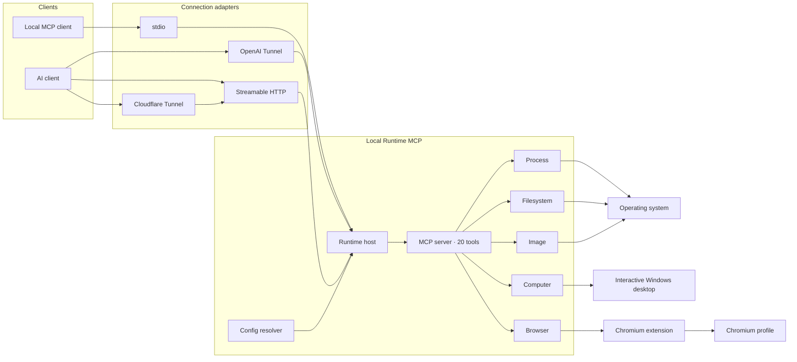
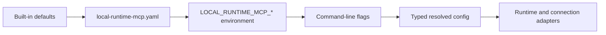
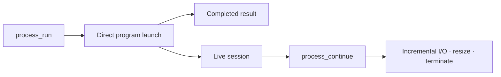
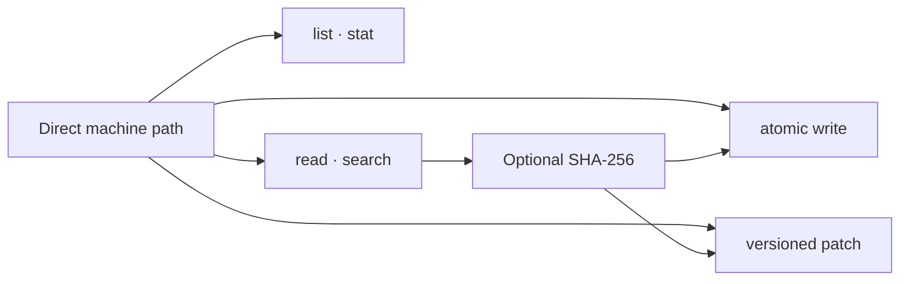
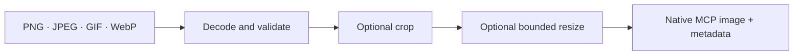
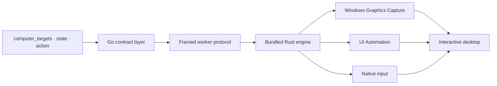
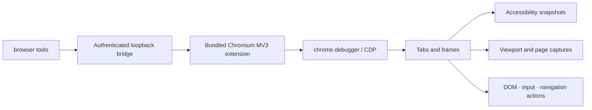

# Local Runtime MCP

[](https://github.com/hicancan/local-runtime-mcp/actions/workflows/ci.yml)
[](https://github.com/hicancan/local-runtime-mcp/releases/latest)
[](LICENSE)

**English** · [简体中文](README.zh-CN.md)

Local Runtime MCP gives AI clients a direct, multimodal interface to the machine running `lrmcp`. One portable runtime exposes 20 MCP tools across processes, files, images, the Windows desktop, and Chromium, with local stdio and remote connection options.

The Windows release is ready to copy to a normal folder or removable drive. Configuration, the browser extension, `lrmcp.exe`, and its Cloudflare companion can travel together as one directory.

## Highlights

- **Five orthogonal capability domains** — process, filesystem, image, computer, and browser.
- **One runtime, several connection adapters** — stdio, OpenAI Tunnel, Streamable HTTP, and Cloudflare Tunnel share the same tools and state model.
- **Native multimodal results** — images, browser captures, and desktop captures return MCP image content.
- **State-aware interaction** — browser references and desktop states are versioned so actions apply to the observation that produced them.
- **Portable configuration** — `local-runtime-mcp.yaml` lives beside the executable and follows the runtime between machines.
- **Cross-platform core** — process, filesystem, image, browser, and transports run on Windows, macOS, and Linux; Windows computer control uses a bundled native engine.

## Architecture

The architecture separates how MCP messages arrive from what the machine can do. Every connection adapter creates the same runtime host, and the host registers one fixed tool surface.



### Connection layer

| Command | Connection | Typical use |
| --- | --- | --- |
| `lrmcp` | MCP over stdio | Local MCP hosts and development tools |
| `lrmcp connect openai` | OpenAI Tunnel | ChatGPT and OpenAI-managed remote sessions |
| `lrmcp serve http` | Streamable HTTP on loopback | A local reverse proxy or integration harness |
| `lrmcp expose cloudflare` | Streamable HTTP through a managed Cloudflare Tunnel | A stable public hostname backed by the local machine |

OpenAI and Cloudflare are alternative exposure providers. Starting either command creates the same runtime and keeps the machine online for the lifetime of that process.

### Runtime layer

`runtimehost` owns the browser bridge, the computer controller, process sessions, and the MCP server. Connection adapters carry MCP messages and lifecycle signals. This boundary keeps every domain independent of the selected network provider.

### Configuration layer

Every entry point uses one resolver and one precedence order:



The fixed configuration path is `<lrmcp directory>/local-runtime-mcp.yaml`. This makes a release directory self-contained and predictable. Command-line values have the highest precedence, followed by environment variables, YAML, and built-in defaults.

## Capability domains

### Process



The process domain launches a program with an argument array, working directory, environment overrides, initial stdin, timeout, and bounded output. Pipe mode keeps stdout and stderr separate. PTY mode supports interactive terminal programs. Longer commands return a session ID that `process_continue` uses for incremental output, input, PTY resize, waiting, and termination.

### Filesystem



The filesystem domain operates on direct absolute paths and paths relative to the runtime working directory. Reads and searches have explicit bounds. Complete writes commit atomically. Patches require the expected SHA-256 and uniquely anchored hunks, providing optimistic concurrency for agent edits.

### Image



The image domain reads visual data as visual content. `image_read` validates byte and pixel limits, supports crop and aspect-preserving resize, and returns an MCP image together with dimensions, media type, and source metadata.

### Computer



The Windows computer domain combines pixels, semantic UI elements, and native input. `computer_targets` returns validated top-level window identities. `computer_state` captures the desktop or foreground target and returns a state ID plus bounded UI Automation references. `computer_action` can activate a target or act through coordinates and semantic references.

Every observed state is an epoch. Activation and physical input advance that epoch, so subsequent actions use a fresh `computer_state`. The Go layer owns the public MCP contract; the embedded Rust worker owns Windows capture, UI Automation, DPI and coordinate handling, foreground validation, and input routing.

### Browser



The browser domain controls the user-selected Chromium profile through the bundled extension. The extension connects to an authenticated loopback bridge and uses Chrome DevTools Protocol capabilities exposed by `chrome.debugger`. This route preserves the profile's active sessions, tabs, extensions, downloads, and browser permissions.

Snapshots return bounded visible text and versioned element references across the main document and child frames. Screenshots return native PNG content and versioned viewport coordinates. Actions cover clicking, dragging, typing, form values, keys, scrolling, selection, checkboxes, file upload, dialogs, and explicit JavaScript evaluation.

## Tool surface

| Domain | MCP tools |
| --- | --- |
| Process | `process_run`, `process_continue` |
| Filesystem | `filesystem_list`, `filesystem_stat`, `filesystem_read_text`, `filesystem_search_text`, `filesystem_write_text`, `filesystem_patch_text` |
| Image | `image_read` |
| Computer | `computer_targets`, `computer_state`, `computer_action` |
| Browser | `browser_status`, `browser_tabs`, `browser_open`, `browser_close`, `browser_navigate`, `browser_snapshot`, `browser_screenshot`, `browser_action` |

## Installation

Download the archive for your platform from [Releases](https://github.com/hicancan/local-runtime-mcp/releases/latest) and extract it into a dedicated directory.

Windows archives contain:

```text
local-runtime-mcp/
├── lrmcp.exe
├── cloudflared.exe
├── config.example.yaml
├── README.md
├── README.zh-CN.md
├── LICENSE
├── THIRD_PARTY_NOTICES.md
└── cloudflared-LICENSE
```

Copy `config.example.yaml` to `local-runtime-mcp.yaml`, then fill the sections used by the selected connection and capabilities:

```yaml
browser:
  listen: 127.0.0.1:9315
  token: "a-random-token-containing-at-least-32-characters"

openai:
  tunnel_id: "your-openai-tunnel-id"
  api_key: "your-openai-tunnel-api-key"

http:
  listen: 127.0.0.1:9316
  public_host: mcp.example.com
  bearer_token: "a-random-token-containing-at-least-32-characters"

cloudflare:
  tunnel_token: "your-cloudflare-managed-tunnel-token"
```

Keep the directory under the control of its operator because the YAML file contains connection credentials.

### Browser extension

Run:

```powershell
./lrmcp.exe browser-setup
```

The command generates a browser token when needed, saves the YAML file beside the executable, and extracts the extension to `browser-extension` in the same directory. Open `edge://extensions` or `chrome://extensions`, enable Developer mode, choose **Load unpacked**, and select that directory.

### Local stdio

Run `lrmcp` as the MCP server process. A typical client entry is:

```json
{
  "mcpServers": {
    "local-runtime-mcp": {
      "command": "C:\\Tools\\local-runtime-mcp\\lrmcp.exe"
    }
  }
}
```

### OpenAI Tunnel

Place the tunnel credentials in the `openai` section and run:

```powershell
./lrmcp.exe connect openai
```

### Cloudflare Tunnel

Create a remotely managed Cloudflare Tunnel, route its hostname to `http://127.0.0.1:9316`, place the hostname, HTTP bearer token, and tunnel token in the YAML file, then run:

```powershell
./lrmcp.exe expose cloudflare
```

The release archive includes the pinned `cloudflared` companion. The public MCP endpoint is `https://<public_host>/mcp`, authenticated by the configured HTTP bearer token.

## Environment and command-line overrides

Portable YAML is the normal operating path. Automation can override individual values with these environment variables:

| Environment variable | YAML field |
| --- | --- |
| `LOCAL_RUNTIME_MCP_BROWSER_LISTEN` | `browser.listen` |
| `LOCAL_RUNTIME_MCP_BROWSER_TOKEN` | `browser.token` |
| `LOCAL_RUNTIME_MCP_OPENAI_TUNNEL_ID` | `openai.tunnel_id` |
| `LOCAL_RUNTIME_MCP_OPENAI_API_KEY` | `openai.api_key` |
| `LOCAL_RUNTIME_MCP_HTTP_LISTEN` | `http.listen` |
| `LOCAL_RUNTIME_MCP_HTTP_PUBLIC_HOST` | `http.public_host` |
| `LOCAL_RUNTIME_MCP_HTTP_BEARER_TOKEN` | `http.bearer_token` |
| `LOCAL_RUNTIME_MCP_CLOUDFLARE_TUNNEL_TOKEN` | `cloudflare.tunnel_token` |
| `LOCAL_RUNTIME_MCP_CLOUDFLARED` | `cloudflare.binary` |

Run `lrmcp help` to see the matching command-line flags.

## Build and test

Requirements: Go 1.27, Node.js 24, and the stable Rust MSVC toolchain for the Windows computer engine.

```powershell
npm --prefix browser-extension ci
npm --prefix browser-extension run build
./scripts/build-native.ps1
go test ./...
go vet ./...
go build ./cmd/lrmcp
```

The CI matrix builds and tests Windows, Linux, and macOS. Windows CI also runs the Chromium extension end-to-end test and Rust formatting and lint checks.

## License

Local Runtime MCP is licensed under [GNU AGPL v3.0 only](LICENSE). Release archives include the separately licensed `cloudflared` companion; attribution and license details are in [THIRD_PARTY_NOTICES.md](THIRD_PARTY_NOTICES.md).
