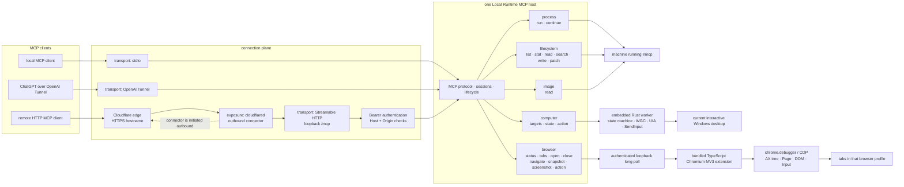
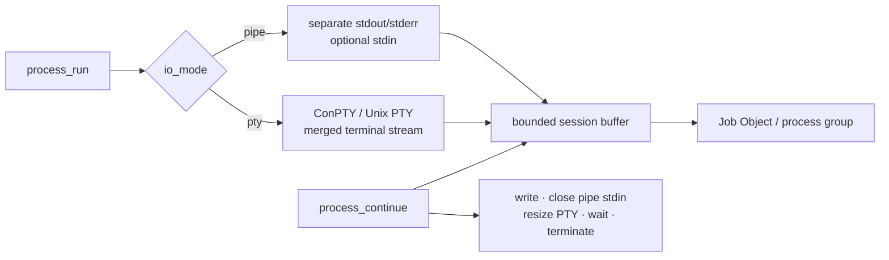
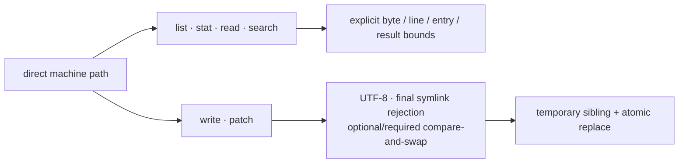
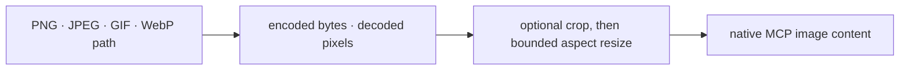
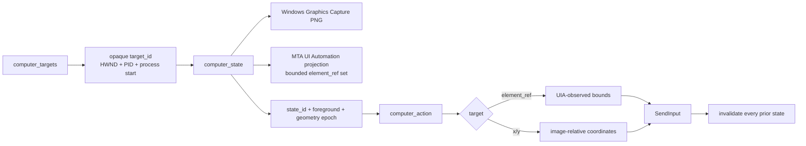
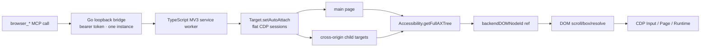

# Local Runtime MCP

Local Runtime MCP lets an MCP client use the machine on which `lrmcp` is running. “Local” describes the relationship to that process, not a laptop-only deployment: the same runtime can run on a workstation, VM, or server.

The project has one MCP runtime, three transport adapters, one optional exposure adapter, and five orthogonal public domains. Its command line is only a lifecycle surface; it is not a second automation API.

## Architecture



The layers are deliberately not interchangeable:

- A **transport** carries MCP messages into the runtime: stdio, OpenAI Tunnel, or Streamable HTTP.
- An **exposure** makes an existing network transport reachable: Cloudflare Tunnel exposes the loopback HTTP origin but does not implement MCP.
- A **domain** describes what the runtime can do after a request arrives: Process, Filesystem, Image, Computer, or Browser.

OpenAI Tunnel terminates directly into an in-memory MCP transport. Cloudflare Tunnel terminates into a loopback HTTP origin. They are therefore separate adapters, not implementations of a fictional common `TunnelProvider`.

There is no capability registry, dynamic plug-in framework, workspace root, host router, generic policy engine, or compatibility layer:

- Go owns MCP, transports, lifecycle, HTTP authentication, the Cloudflare child-process boundary, bounded data contracts, Process, Filesystem, Image, and the Browser bridge.
- Rust owns the complete Windows Computer state machine behind a private framed protocol.
- TypeScript owns the Chromium extension and CDP session graph.
- Every transport reaches the same runtime and the same 20 tools.
- Each running instance represents exactly one machine. Distinct machines use separate OpenAI connector identities or separate Cloudflare Tunnel UUIDs and hostnames; they are never replicas behind one identity.

The Rust worker is compiled before the Windows Go build and embedded into `lrmcp.exe`. At runtime it is extracted to a private temporary directory and launched hidden. The optional, separately licensed `cloudflared` executable remains a supervised companion process so Cloudflare's protocol and update lifecycle never enter the core.

## Public surface: 20 MCP tools

### Process (2)



| Tool | Exact contract |
| --- | --- |
| `process_run` | Starts `program` directly with an argument array, working directory, deterministic environment overrides, initial text input, lifetime timeout, retained-output bound, and yield time. No implicit shell is inserted. `io_mode: pipe` keeps stdout/stderr separate; `io_mode: pty` creates ConPTY on Windows or a Unix PTY with an initial row/column size. A long-running process returns a session ID. |
| `process_continue` | Drains only new output, writes input, closes pipe stdin, resizes a PTY, waits again, or terminates the process tree. PTY output is intentionally one merged terminal stream and PTY input cannot be half-closed. |

On Windows, processes are assigned to a kill-on-close Job Object; on Unix, the root represents an isolated process group/session. Timeout, explicit termination, server cancellation, and shutdown act on the tree rather than only the first PID.

### Filesystem (6)



Paths may be absolute or relative to the `lrmcp` working directory. Returned paths are absolute. No synthetic workspace boundary is imposed.

| Tool | Exact contract |
| --- | --- |
| `filesystem_list` | Walks a directory without following symbolic links. Depth, hidden-name behavior, and entry count are explicit; truncation and skipped entries are returned. |
| `filesystem_stat` | Inspects the path itself without following a final symlink. Returns type, bytes, timestamp, MIME information, link target, and optional SHA-256. |
| `filesystem_read_text` | Reads complete UTF-8 lines from a one-based cursor, bounded by line count and bytes. Returns the next cursor, truncation state, and optional whole-file SHA-256. |
| `filesystem_search_text` | Searches one file or tree using literal text or a Go regular expression. Binary, oversized, unreadable, or excluded files are counted as skipped. |
| `filesystem_write_text` | Atomically creates or replaces a complete UTF-8 file. Supports create-only, optional expected SHA-256, and explicit parent creation. |
| `filesystem_patch_text` | Requires `expected_sha256`. Every `{before, old, new, after}` hunk is located uniquely against the same immutable original file; ambiguous, missing, or overlapping hunks fail before any write. An empty `old` is an insertion and requires context. All validated hunks commit once and return the new SHA-256. |

`filesystem_patch_text` replaces the old sequential replacement API. There is no fuzzy matching and no compatibility alias.

### Image (1)



| Tool | Exact contract |
| --- | --- |
| `image_read` | Returns an image as native MCP image content. Source bytes and decoded pixels are bounded independently. Optional `crop_*`, `max_width`, and `max_height` project a model-appropriate view without creating a second tool; transformed output is PNG and reports both source and output dimensions. |

Image is separate from Filesystem because model-visible image content is a different modality, not because it owns a different path namespace.

### Computer (3, Windows amd64)



| Tool | Exact contract |
| --- | --- |
| `computer_targets` | Lists capturable top-level windows. Each opaque `target_id` binds HWND, PID, and process creation time so recycled handles are rejected. Program launch remains `process_run`. |
| `computer_state` | Captures the complete physical-pixel virtual desktop or one already-foreground target through WGC, returns native PNG, cursor/image geometry, one `state_id`, and a bounded UIA projection. UIA collection runs on a separate MTA thread with a finite observation deadline. |
| `computer_action` | Activates a target, or performs move, click, double-click, drag, typing, replacement, key combination, or scroll using exactly the observed state. Physical operations may target either image-relative coordinates or an `element_ref`. |

Computer invariants:

1. `activate` requires `target_id`, rejects `state_id`, and invalidates all observations.
2. Every other action requires the exact `state_id` returned by `computer_state`.
3. A selected target must already be foreground when observed; state capture never silently activates it.
4. State binds worker generation, target identity, foreground HWND, target geometry, UIA refs, and action epoch.
5. An action validates all coordinates against the returned image before translation.
6. Every successful action invalidates every older state. Observe again before the next action.
7. `SendInput` obeys Windows UIPI; a non-elevated process cannot inject into a higher-integrity application.

The Go host contains no second Computer implementation. macOS, Linux, and non-amd64 Windows keep the tools discoverable and return an explicit unsupported-platform error.

### Browser (8, Chromium extension)



| Tool | Exact contract |
| --- | --- |
| `browser_status` | Reports whether the bridge is configured and fresh, plus browser, extension version, address, instance, and last-seen time. |
| `browser_tabs` | Lists controllable tabs in the profile containing the extension; browser-internal and extension URLs are excluded. |
| `browser_open` | Opens a tab and waits for loading. |
| `browser_close` | Closes one tab by numeric browser tab ID. |
| `browser_navigate` | Performs `url`, `back`, `forward`, or `reload`, then waits for loading. |
| `browser_snapshot` | Reads bounded CDP Accessibility trees from the main target and auto-attached OOPIF sessions. Interactive nodes receive versioned refs backed by `backendDOMNodeId`; up to eight unchanged-page snapshots are retained. |
| `browser_screenshot` | Returns viewport, full-page, or clipped native PNG. An exact viewport capture also returns a versioned `screenshot_id` for coordinate targeting. |
| `browser_action` | Performs click, double-click, hover, drag, typing, replacement, key input, scroll, select, check, file upload, dialog handling, or explicit JavaScript evaluation. Element operations use refs; physical page operations use screenshot coordinates. |

There is one Browser backend: the bundled extension using `chrome.debugger`. It is not a second Computer backend. CSS selector targeting was removed because it created a parallel, unobserved identity system. `evaluate` remains an explicit escape hatch, not a normal element locator.

Each tab has one page epoch. Loading, navigation, or any successful action invalidates every ref and screenshot ID from the earlier epoch. The loopback bridge authenticates every request with a generated bearer token, requires the exact extension version, accepts one extension instance at a time, and times out abandoned calls.

## Install

Download an archive from [Releases](https://github.com/hicancan/local-runtime-mcp/releases), extract it, and optionally add the directory containing `lrmcp` or `lrmcp.exe` to `PATH`. Release archives also contain the pinned `cloudflared` companion; it is used only by `lrmcp expose cloudflare`.

Verify it:

```powershell
lrmcp version
```

### Build from source

All platforms build the TypeScript extension first:

```powershell
Set-Location browser-extension
npm ci
npm run build
Set-Location ..
```

Windows amd64 additionally builds and embeds the Rust Computer worker:

```powershell
./scripts/build-native.ps1
go build -o lrmcp.exe ./cmd/lrmcp
```

Linux and macOS do not build the Windows worker:

```powershell
go build -o lrmcp ./cmd/lrmcp
```

## Browser setup

The optional Browser bridge is the only persistent configuration:

```yaml
browser:
  listen: 127.0.0.1:9315
  token: ${LRMCP_BROWSER_TOKEN}
```

Generate and save a token, extract the exact extension embedded in the binary, and package its loopback settings:

```powershell
lrmcp browser-setup
```

The command prints the extension and config paths but never the token. In `edge://extensions` or `chrome://extensions`, enable Developer mode, choose **Load unpacked**, and select the printed directory. The Browser bridge has its own bundled protocol version; rerun setup and reload the extension only when `browser_status` reports a version mismatch.

## Connect

With no subcommand, `lrmcp` serves MCP over stdio:

```powershell
lrmcp
lrmcp --config C:\path\to\config.yaml
```

For ChatGPT using OpenAI Tunnel:

```powershell
$env:OPENAI_TUNNEL_ID = "..."
$env:OPENAI_TUNNEL_API_KEY = "..."
lrmcp connect openai
```

For direct, authenticated Streamable HTTP on loopback:

```powershell
$env:LRMCP_HTTP_TOKEN_FILE = "$env:USERPROFILE\.lrmcp\http-token"
lrmcp serve http
```

For the configured Cloudflare hostname:

```powershell
$env:LRMCP_HTTP_TOKEN_FILE = "$env:USERPROFILE\.lrmcp\http-token"
$env:TUNNEL_TOKEN_FILE = "$env:USERPROFILE\.lrmcp\cloudflare-token"
lrmcp expose cloudflare --hostname mcp.example.com
```

The resulting MCP endpoint is `https://mcp.example.com/mcp`. The HTTP token file must contain one random secret of at least 32 characters; every request supplies it as `Authorization: Bearer <token>`. `TUNNEL_TOKEN_FILE` authenticates `cloudflared` to Cloudflare; it does **not** authenticate MCP callers. The HTTP server always binds to loopback and has no unauthenticated mode.

```text
lrmcp [--config PATH]           MCP over stdio
lrmcp connect openai [flags]    MCP over OpenAI Tunnel
lrmcp serve http [flags]        MCP over loopback Streamable HTTP
lrmcp expose cloudflare [flags] Streamable HTTP + supervised cloudflared
lrmcp browser-setup [flags]     extract/configure the bundled extension
lrmcp version
lrmcp help
```

The CLI exists because the server needs a human-started lifecycle and transport entry. If you already have a shell or SSH session and only need native commands, use that shell directly.

## Development and verification

```powershell
Set-Location browser-extension
npm ci
npm run build
Set-Location ..

./scripts/build-native.ps1   # Windows amd64
cargo fmt --manifest-path native/computer-windows/Cargo.toml --check
cargo clippy --manifest-path native/computer-windows/Cargo.toml --all-targets -- -D warnings
go test ./...
go vet ./...
go build ./cmd/lrmcp
```

Real isolated Edge E2E:

```powershell
$env:LRMCP_BROWSER_E2E = "1"
go test ./internal/browser -run TestEdgeExtensionEndToEnd -count=1 -v
```

Real interactive-desktop WGC/UIA/input smoke (moves the pointer):

```powershell
$env:LRMCP_DESKTOP_SMOKE = "1"
go test ./internal/computer -run TestWindowsDesktopSmoke -count=1 -v
```

CI builds the TypeScript output on Windows, Linux, and macOS; compiles/lints Rust and builds the embedded worker on Windows; runs Go tests everywhere, the race detector on Linux, real isolated Edge E2E on Windows, `go vet`, final builds, and a checksum-verified `cloudflared` companion smoke test. A `v*` tag builds five release archives with the correct pinned companion and publishes one GitHub release.

## v7 breaking changes

- The ambiguous `lrmcp tunnel` command was deleted; OpenAI is now explicit as `lrmcp connect openai`.
- `CONTROL_PLANE_TUNNEL_ID` and `CONTROL_PLANE_API_KEY` were deleted; use `OPENAI_TUNNEL_ID` and `OPENAI_TUNNEL_API_KEY`.
- Streamable HTTP and Cloudflare exposure were added as separate static adapters. Cloudflare is not a second MCP implementation.
- HTTP requires a bearer token of at least 32 characters, accepts only loopback listeners, validates the request host, and rejects browser-origin requests.
- No v6 command aliases or environment-variable fallbacks remain.

## License

[GNU Affero General Public License v3.0 only](LICENSE). Modified versions offered to users over a network must make their corresponding source available under the same license. The optional unmodified `cloudflared` companion is a separate Apache-2.0 program; see [third-party notices](THIRD_PARTY_NOTICES.md).
