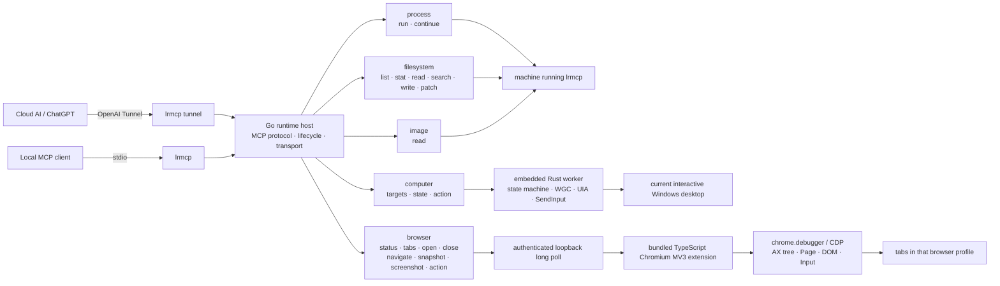
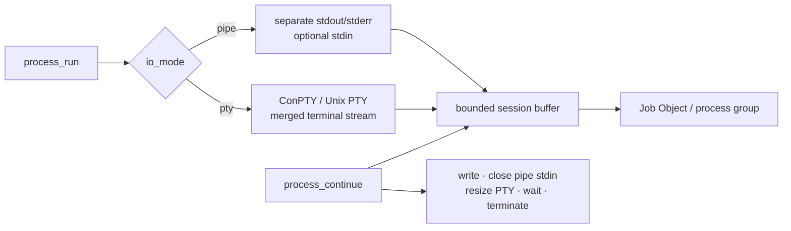
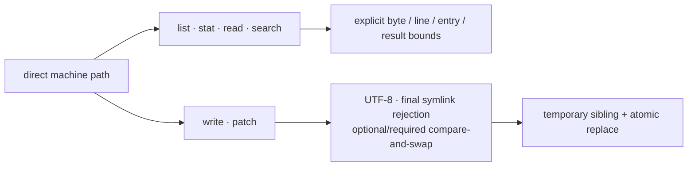
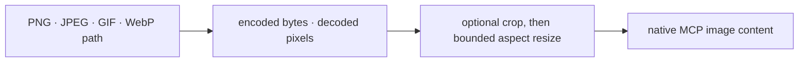
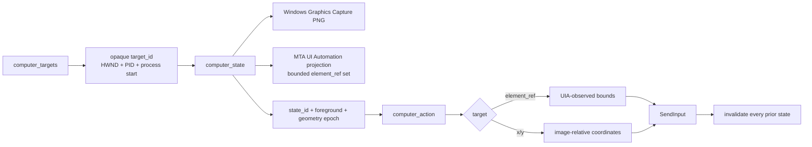
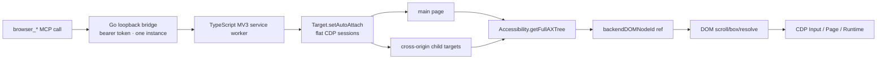

# Local Runtime MCP

Local Runtime MCP lets an MCP client use the machine on which `lrmcp` is running. “Local” describes the relationship to that process, not a laptop-only deployment: the same binary can run on a workstation, VM, or server.

The project has one distributed executable, one MCP server, two transports, and five orthogonal public domains. Its command line is only a lifecycle surface; it is not a second automation API.

## Architecture



The arrows are the architecture. There is no generic “core”, capability registry, dynamic plug-in framework, workspace root, host router, policy engine, or compatibility layer:

- Go owns MCP, transports, lifecycle, bounded data contracts, Process, Filesystem, Image, and the Browser bridge.
- Rust owns the complete Windows Computer state machine behind a private framed protocol.
- TypeScript owns the Chromium extension and CDP session graph.
- stdio and OpenAI Tunnel are adapters to the same MCP server, never alternate domain implementations.
- Each running instance represents exactly one machine. Multiple machines use separate instances and connector identities.

The Rust worker is compiled before the Windows Go build and embedded into `lrmcp.exe`. At runtime it is extracted to a private temporary directory and launched hidden. Users still distribute one file, while capture/UIA failures remain isolated from the MCP transport process.

## Public surface: 20 MCP tools

### Process (2)



| Tool | Exact contract |
| --- | --- |
| `process_run` | Starts `program` directly with an argument array, working directory, deterministic environment overrides, initial text input, lifetime timeout, retained-output bound, and yield time. No implicit shell is inserted. `io_mode: pipe` keeps stdout/stderr separate; `io_mode: pty` creates ConPTY on Windows or a Unix PTY with an initial row/column size. A long-running process returns a session ID. |
| `process_continue` | Drains only new output, writes input, closes pipe stdin, resizes a PTY, waits again, or terminates the process tree. PTY output is intentionally one merged terminal stream and PTY input cannot be half-closed. |

On Windows, processes are assigned to a kill-on-close Job Object; on Unix, the root represents an isolated process group/session. Timeout, explicit termination, server cancellation, and shutdown act on the tree rather than only the first PID.

### Filesystem (6)



Paths may be absolute or relative to the `lrmcp` working directory. Returned paths are absolute. No synthetic workspace boundary is imposed.

| Tool | Exact contract |
| --- | --- |
| `filesystem_list` | Walks a directory without following symbolic links. Depth, hidden-name behavior, and entry count are explicit; truncation and skipped entries are returned. |
| `filesystem_stat` | Inspects the path itself without following a final symlink. Returns type, bytes, timestamp, MIME information, link target, and optional SHA-256. |
| `filesystem_read_text` | Reads complete UTF-8 lines from a one-based cursor, bounded by line count and bytes. Returns the next cursor, truncation state, and optional whole-file SHA-256. |
| `filesystem_search_text` | Searches one file or tree using literal text or a Go regular expression. Binary, oversized, unreadable, or excluded files are counted as skipped. |
| `filesystem_write_text` | Atomically creates or replaces a complete UTF-8 file. Supports create-only, optional expected SHA-256, and explicit parent creation. |
| `filesystem_patch_text` | Requires `expected_sha256`. Every `{before, old, new, after}` hunk is located uniquely against the same immutable original file; ambiguous, missing, or overlapping hunks fail before any write. An empty `old` is an insertion and requires context. All validated hunks commit once and return the new SHA-256. |

`filesystem_patch_text` replaces the old sequential replacement API. There is no fuzzy matching and no compatibility alias.

### Image (1)



| Tool | Exact contract |
| --- | --- |
| `image_read` | Returns an image as native MCP image content. Source bytes and decoded pixels are bounded independently. Optional `crop_*`, `max_width`, and `max_height` project a model-appropriate view without creating a second tool; transformed output is PNG and reports both source and output dimensions. |

Image is separate from Filesystem because model-visible image content is a different modality, not because it owns a different path namespace.

### Computer (3, Windows amd64)



| Tool | Exact contract |
| --- | --- |
| `computer_targets` | Lists capturable top-level windows. Each opaque `target_id` binds HWND, PID, and process creation time so recycled handles are rejected. Program launch remains `process_run`. |
| `computer_state` | Captures the complete physical-pixel virtual desktop or one already-foreground target through WGC, returns native PNG, cursor/image geometry, one `state_id`, and a bounded UIA projection. UIA collection runs on a separate MTA thread with a finite observation deadline. |
| `computer_action` | Activates a target, or performs move, click, double-click, drag, typing, replacement, key combination, or scroll using exactly the observed state. Physical operations may target either image-relative coordinates or an `element_ref`. |

Computer invariants:

1. `activate` requires `target_id`, rejects `state_id`, and invalidates all observations.
2. Every other action requires the exact `state_id` returned by `computer_state`.
3. A selected target must already be foreground when observed; state capture never silently activates it.
4. State binds worker generation, target identity, foreground HWND, target geometry, UIA refs, and action epoch.
5. An action validates all coordinates against the returned image before translation.
6. Every successful action invalidates every older state. Observe again before the next action.
7. `SendInput` obeys Windows UIPI; a non-elevated process cannot inject into a higher-integrity application.

The Go host contains no second Computer implementation. macOS, Linux, and non-amd64 Windows keep the tools discoverable and return an explicit unsupported-platform error.

### Browser (8, Chromium extension)



| Tool | Exact contract |
| --- | --- |
| `browser_status` | Reports whether the bridge is configured and fresh, plus browser, extension version, address, instance, and last-seen time. |
| `browser_tabs` | Lists controllable tabs in the profile containing the extension; browser-internal and extension URLs are excluded. |
| `browser_open` | Opens a tab and waits for loading. |
| `browser_close` | Closes one tab by numeric browser tab ID. |
| `browser_navigate` | Performs `url`, `back`, `forward`, or `reload`, then waits for loading. |
| `browser_snapshot` | Reads bounded CDP Accessibility trees from the main target and auto-attached OOPIF sessions. Interactive nodes receive versioned refs backed by `backendDOMNodeId`; up to eight unchanged-page snapshots are retained. |
| `browser_screenshot` | Returns viewport, full-page, or clipped native PNG. An exact viewport capture also returns a versioned `screenshot_id` for coordinate targeting. |
| `browser_action` | Performs click, double-click, hover, drag, typing, replacement, key input, scroll, select, check, file upload, dialog handling, or explicit JavaScript evaluation. Element operations use refs; physical page operations use screenshot coordinates. |

There is one Browser backend: the bundled extension using `chrome.debugger`. It is not a second Computer backend. CSS selector targeting was removed because it created a parallel, unobserved identity system. `evaluate` remains an explicit escape hatch, not a normal element locator.

Each tab has one page epoch. Loading, navigation, or any successful action invalidates every ref and screenshot ID from the earlier epoch. The loopback bridge authenticates every request with a generated bearer token, requires the exact extension version, accepts one extension instance at a time, and times out abandoned calls.

## Install

Download an archive from [Releases](https://github.com/hicancan/local-runtime-mcp/releases), extract `lrmcp` or `lrmcp.exe`, and optionally add its directory to `PATH`.

Verify it:

```powershell
lrmcp version
```

### Build from source

All platforms build the TypeScript extension first:

```powershell
Set-Location browser-extension
npm ci
npm run build
Set-Location ..
```

Windows amd64 additionally builds and embeds the Rust Computer worker:

```powershell
./scripts/build-native.ps1
go build -o lrmcp.exe ./cmd/lrmcp
```

Linux and macOS do not build the Windows worker:

```powershell
go build -o lrmcp ./cmd/lrmcp
```

## Browser setup

The optional Browser bridge is the only persistent configuration:

```yaml
browser:
  listen: 127.0.0.1:9315
  token: ${LRMCP_BROWSER_TOKEN}
```

Generate and save a token, extract the exact extension embedded in the binary, and package its loopback settings:

```powershell
lrmcp browser-setup
```

The command prints the extension and config paths but never the token. In `edge://extensions` or `chrome://extensions`, enable Developer mode, choose **Load unpacked**, and select the printed directory. After upgrading `lrmcp`, run setup again and reload the unpacked extension; server and extension versions must match.

## Connect

With no subcommand, `lrmcp` serves MCP over stdio:

```powershell
lrmcp
lrmcp --config C:\path\to\config.yaml
```

For a ChatGPT custom connector using OpenAI Tunnel:

```powershell
$env:CONTROL_PLANE_TUNNEL_ID = "..."
$env:CONTROL_PLANE_API_KEY = "..."
lrmcp tunnel
```

```text
lrmcp [--config PATH]       MCP over stdio
lrmcp tunnel [flags]        MCP over OpenAI Tunnel
lrmcp browser-setup [flags] extract/configure the bundled extension
lrmcp version
lrmcp help
```

The CLI exists because the server needs a human-started lifecycle and transport entry. If you already have a shell or SSH session and only need native commands, use that shell directly.

## Development and verification

```powershell
Set-Location browser-extension
npm ci
npm run build
Set-Location ..

./scripts/build-native.ps1   # Windows amd64
cargo fmt --manifest-path native/computer-windows/Cargo.toml --check
cargo clippy --manifest-path native/computer-windows/Cargo.toml --all-targets -- -D warnings
go test ./...
go vet ./...
go build ./cmd/lrmcp
```

Real isolated Edge E2E:

```powershell
$env:LRMCP_BROWSER_E2E = "1"
go test ./internal/browser -run TestEdgeExtensionEndToEnd -count=1 -v
```

Real interactive-desktop WGC/UIA/input smoke (moves the pointer):

```powershell
$env:LRMCP_DESKTOP_SMOKE = "1"
go test ./internal/computer -run TestWindowsDesktopSmoke -count=1 -v
```

CI builds the TypeScript output on Windows, Linux, and macOS; compiles/lints Rust and builds the embedded worker on Windows; runs Go tests everywhere, the race detector on Linux, real isolated Edge E2E on Windows, `go vet`, and final builds. A `v*` tag builds five release archives and publishes one GitHub release.

## v6 breaking changes

- `filesystem_edit_text` was deleted; `filesystem_patch_text` requires immutable-base hunks and `expected_sha256`.
- Process gained PTY/ConPTY mode and terminal resize without adding another public tool.
- Image gained bounded crop/resize projection without adding another public tool.
- Computer moved completely from the Go Win32 implementation to an embedded Rust WGC/UIA worker. Bare numeric `window_id` became opaque `target_id`; state now exposes UIA `element_ref` values.
- Browser moved from injected DOM traversal to TypeScript + CDP Accessibility trees with flat OOPIF sessions. CSS selector targeting was deleted.
- No v5 aliases, deprecated fields, migration shims, or alternate backends remain.

## License

[MIT](LICENSE)
