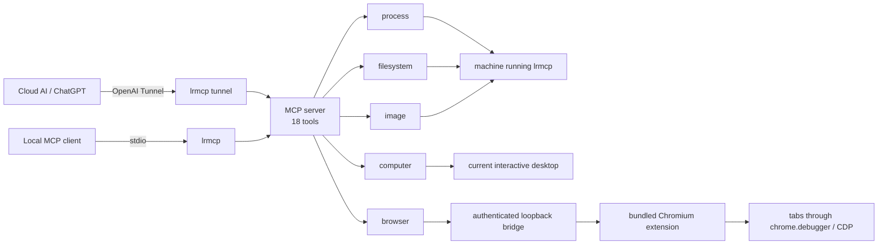

# Local Runtime MCP

`local-runtime-mcp` lets an MCP client use the machine on which `lrmcp` is running. “Local” is relative to the process: the same binary can run on a laptop, workstation, VM, or remote server. Each running instance represents exactly one machine.

The project deliberately has one capability API: MCP. The executable's command line only selects transport or performs browser setup; it does not duplicate the MCP tools.

## Architecture



There is no generic `core`, capability registry, dynamic plugin system, host router, workspace model, root sandbox, or compatibility layer. The five domains are ordinary compile-time Go packages registered directly on one MCP server.

## MCP tools

### Process

| Tool | Function |
| --- | --- |
| `process_run` | Execute one program without shell parsing. Accepts `program`, argument array, direct working directory, environment overrides, stdin, timeout, and independent stdout/stderr limits. |

### Filesystem

All paths can be absolute or relative to the `lrmcp` process working directory. Results use absolute paths.

| Tool | Function |
| --- | --- |
| `filesystem_list` | Recursively list a directory with depth and hidden-file controls. |
| `filesystem_stat` | Inspect a file or directory and detect regular-file MIME type. |
| `filesystem_read_text` | Read bounded UTF-8 text without merging binary/image handling into text. |
| `filesystem_write_text` | Create or atomically replace a UTF-8 file; optional create-only mode. |
| `filesystem_edit_text` | Exact text replacement; rejects ambiguous matches unless `replace_all` is set. |
| `filesystem_search_text` | Literal or Go-regexp search across bounded UTF-8 files. |

### Image

| Tool | Function |
| --- | --- |
| `image_read` | Read PNG, JPEG, GIF, or WebP from a direct path and return native MCP image content plus dimensions and MIME metadata. |

### Computer

| Tool | Function |
| --- | --- |
| `computer_screenshot` | Capture the current interactive desktop as native PNG, including virtual-screen origin, size, and cursor coordinates. |
| `computer_action` | Move/click/drag the pointer, type Unicode, press key combinations, or scroll. |

Windows uses native Win32 input and desktop capture; macOS uses `screencapture` plus `cliclick`; Linux uses `gnome-screenshot` or `scrot` plus `xdotool`. On Windows, `lrmcp` must run in the signed-in interactive session. The external macOS/Linux helpers must be installed for input control.

### Browser

| Tool | Function |
| --- | --- |
| `browser_status` | Report bridge configuration, connection state, last contact, and extension identity. |
| `browser_tabs` | List controllable tabs in the profile containing the extension. |
| `browser_open` | Open a tab. |
| `browser_close` | Close a tab. |
| `browser_navigate` | Navigate an existing tab. |
| `browser_snapshot` | Return visible page text and stable references for interactive elements. |
| `browser_screenshot` | Capture a tab viewport as native PNG. |
| `browser_action` | Click/type by snapshot reference or selector, press keys, scroll, evaluate JavaScript, or navigate history. |

Browser control has one implementation path: the bundled Manifest V3 Chromium extension. It uses `chrome.debugger` as the CDP transport and requests only `debugger`, `tabs`, and `storage`, plus loopback host access. The bridge binds only to loopback, authenticates with a generated token, and accepts one extension instance at a time.

## Build

```powershell
go build -o lrmcp.exe ./cmd/lrmcp
```

## Browser setup

The only configuration is for the optional browser bridge:

```yaml
browser:
  listen: 127.0.0.1:9315
  token: ${LRMCP_BROWSER_TOKEN}
```

Generate a token, save the configuration, extract the bundled extension, and package the bridge settings in one command:

```powershell
lrmcp browser-setup
```

The command prints the extension directory without printing the token. Open `edge://extensions` or `chrome://extensions`, enable Developer mode, select **Load unpacked**, and choose that directory.

## Connect

Run with no subcommand for stdio MCP:

```powershell
lrmcp
lrmcp --config C:\path\to\config.yaml
```

For a ChatGPT custom connector, obtain its Tunnel ID and API key, place the key in an environment variable, and run:

```powershell
$env:CONTROL_PLANE_TUNNEL_ID = "..."
$env:CONTROL_PLANE_API_KEY = "..."
lrmcp tunnel
```

Each additional machine runs its own `lrmcp` process and gets its own connector/tunnel identity. This project does not aggregate machines or choose a host on behalf of the model.

## CLI surface

```text
lrmcp [--config PATH]       # stdio MCP
lrmcp tunnel [flags]        # OpenAI Tunnel transport
lrmcp browser-setup [flags] # browser bridge setup
lrmcp version
lrmcp help
```

## Development

```powershell
go test ./...
go vet ./...
go test -race ./...
```

Version 3.0 intentionally removes the 2.x root model, filesystem/process/image CLI mirrors, enable flags, SHA-based write protocol, `serve` alias, and all compatibility shims.

## License

[MIT](LICENSE)
