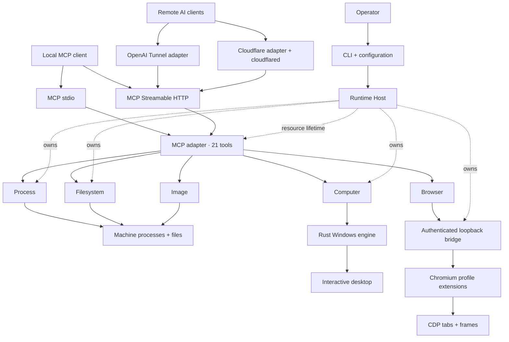
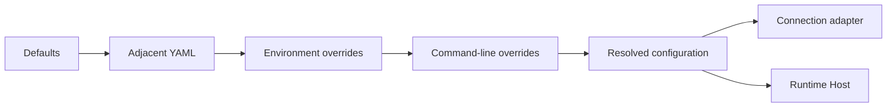
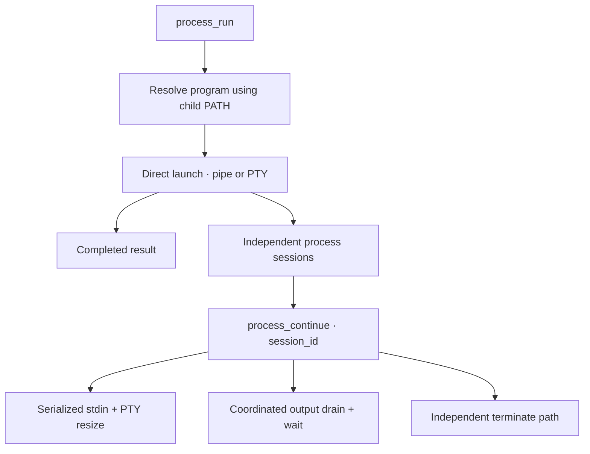
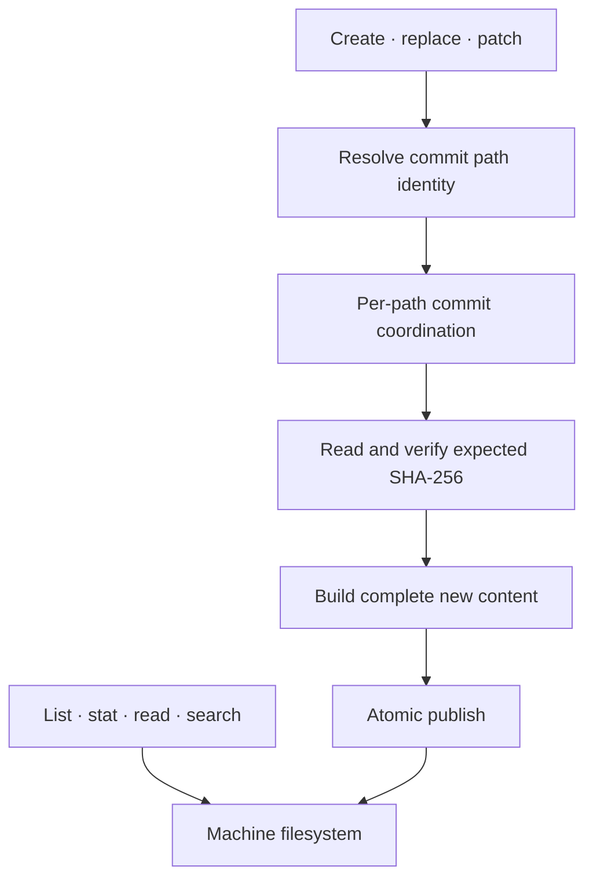
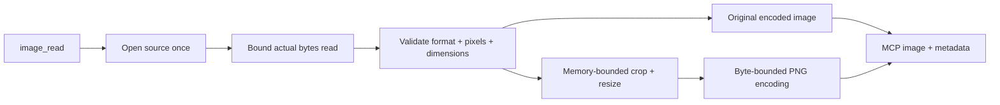
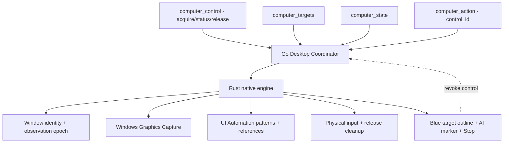
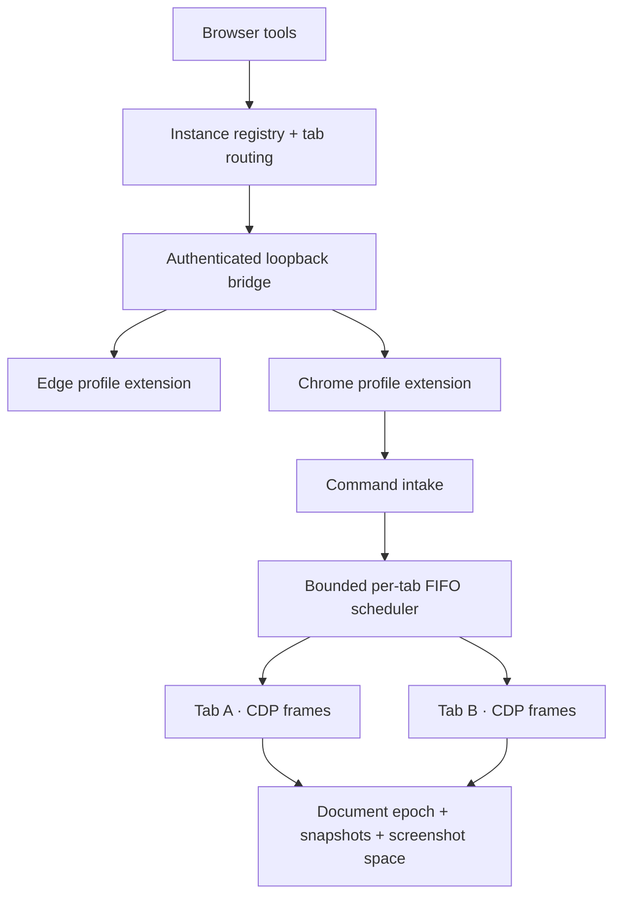

# Local Runtime MCP

[](https://github.com/hicancan/local-runtime-mcp/actions/workflows/ci.yml)
[](https://github.com/hicancan/local-runtime-mcp/releases/latest)
[](LICENSE)
[](https://m8ven.ai/mcp/hicancan/local-runtime-mcp)

**English** · [简体中文](README.zh-CN.md)

Give AI clients the programs, files, images, browser profiles, and desktop of the machine running `lrmcp`. Local Runtime MCP is a portable host-access runtime with **21 MCP tools across five capability domains**.

Use it locally over stdio or Streamable HTTP, or connect a remote client through OpenAI Secure MCP Tunnel or Cloudflare Tunnel. Independent process sessions and browser tabs run concurrently; shared files and desktop input have explicit coordination rules.

- **Native multimodal results.** Files, browser pages, and desktop observations return text and MCP image content directly.
- **Explicit browser targets.** Connect several Chromium profiles, select a named browser instance, and operate its opaque tab handles.
- **Visible desktop control.** Acquire desktop control, observe a window, act on that observation, and release control. A blue overlay and Stop affordance make interaction visible locally.
- **Portable configuration.** Keep `local-runtime-mcp.yaml`, the executable, and browser integration together on a fixed or removable drive.
- **Platform-specific engines.** Go hosts the runtime and MCP adapters; Rust implements Windows capture, UI Automation, and input; TypeScript implements Chromium integration.

## Architecture

The connection layer delivers MCP requests. The capability layer defines machine operations. One Runtime Host owns the resources shared by all clients of a running instance.


```mermaid
flowchart TB
    Operator[Operator] --> CLI[CLI + configuration]
    CLI --> Host[Runtime Host]
    Local[Local MCP client] --> Stdio[MCP stdio]
    Local --> HTTP[MCP Streamable HTTP]
    Remote[Remote AI clients] --> OpenAI[OpenAI Tunnel adapter]
    Remote --> Cloudflare[Cloudflare adapter + cloudflared]
    OpenAI --> HTTP
    Cloudflare --> HTTP
    Stdio --> MCP[MCP adapter · 21 tools]
    HTTP --> MCP
    MCP --> Process[Process]
    MCP --> Files[Filesystem]
    MCP --> Image[Image]
    MCP --> Computer[Computer]
    MCP --> Browser[Browser]
    Process --> Machine[Machine processes + files]
    Files --> Machine
    Image --> Machine
    Computer --> Native[Rust Windows engine]
    Native --> Desktop[Interactive desktop]
    Browser --> Bridge[Authenticated loopback bridge]
    Bridge --> Profiles[Chromium profile extensions]
    Profiles --> CDP[CDP tabs + frames]
    Host -. resource lifetime .-> MCP
    Host -. owns .-> Process
    Host -. owns .-> Files
    Host -. owns .-> Computer
    Host -. owns .-> Bridge
```

Solid arrows show request flow; dotted arrows show lifetime ownership. Images and text are MCP content types carried by the selected transport.

| Layer | Responsibility |
| --- | --- |
| CLI and configuration | Choose a connection mode and resolve configuration once. |
| Connection adapters | Deliver requests through stdio, HTTP, or a tunnel provider. |
| MCP adapter | Publish tool schemas, validate inputs, and encode results. |
| Capability services | Define resource identities, observations, actions, and concurrency. |
| Platform backends | Execute OS operations, Windows native interaction, and Chromium CDP commands. |

The Host creates the Process Manager, Filesystem Service, Browser Bridge, and Computer Controller. Shutdown stops admission, cancels pending work, cleans up managed processes and input, and closes listeners and helpers. Individual request failures retain the running Host and its other resources.

### Commands and transports

```text
lrmcp
├── serve
│   ├── stdio
│   └── http
├── tunnel
│   ├── openai
│   └── cloudflare
├── setup
│   └── browser
├── version
└── help
```

Each runtime invocation selects one connection mode. The seven command paths cover connection startup, browser setup, and executable information.

| Command | Connection and credentials |
| --- | --- |
| `lrmcp serve stdio` | Standard MCP process pipes; the parent process supplies access. |
| `lrmcp serve http` | Loopback Streamable HTTP with a configured Bearer token. |
| `lrmcp tunnel openai` | Official OpenAI HTTP forwarding to a private loopback MCP endpoint; configure the tunnel ID and API key. |
| `lrmcp tunnel cloudflare` | Official `cloudflared` companion forwards to loopback HTTP; configure a Cloudflare tunnel token and an MCP Bearer token. |
| `lrmcp setup browser` | Generate bridge credentials and extract/configure the extension. |
| `lrmcp version` | Print the executable version. |
| `lrmcp help` | Show commands and flags. |

OpenAI starts its private endpoint on a dynamically assigned loopback port and uses a fresh, in-memory private-hop credential. Provider forwarding uses standard HTTP connections to the shared MCP server. Cloudflare uses the configured loopback origin and its maintained companion executable. Domain services remain independent of either provider.

### Configuration


```mermaid
flowchart LR
    Defaults[Defaults] --> YAML[Adjacent YAML]
    YAML --> Environment[Environment overrides]
    Environment --> Flags[Command-line overrides]
    Flags --> Config[Resolved configuration]
    Config --> Connection[Connection adapter]
    Config --> Host[Runtime Host]
```

Precedence is **command line > environment > YAML > defaults**. The file path is always `<lrmcp directory>/local-runtime-mcp.yaml`. Browser instance identity belongs to each browser profile's extension storage; process, tab, and desktop observation handles belong to the current runtime lifecycle.

## Capability domains

| Domain | Tools |
| --- | ---: |
| Process | 2 |
| Filesystem | 6 |
| Image | 1 |
| Computer | 4 |
| Browser | 8 |
| **Total** | **21** |

### Process · 2 tools


```mermaid
flowchart TB
    Run[process_run] --> Resolve[Resolve program using child PATH]
    Resolve --> Launch[Direct launch · pipe or PTY]
    Launch --> Final[Completed result]
    Launch --> Sessions[Independent process sessions]
    Sessions --> Continue[process_continue · session_id]
    Continue --> Input[Serialized stdin + PTY resize]
    Continue --> Output[Coordinated output drain + wait]
    Continue --> Stop[Independent terminate path]
```

- `process_run` accepts `program`, argument array, working directory, environment overrides, initial stdin, execution timeout, output limits, and pipe or PTY I/O.
- `process_continue` reads incremental output, writes stdin, closes pipe input, resizes a PTY, waits, or terminates a managed session.

Bare program names use the merged child `PATH` in both I/O modes; Windows also uses `PATHEXT`. Explicit relative executable paths resolve against the requested working directory. To execute shell syntax, launch the desired shell explicitly with its arguments.

Different sessions run concurrently. Within one session, input writes are serialized and each result drains stdout and stderr together. Waiting for output leaves termination available, including when stdin is blocked. Output and queued input are bounded; a single stdin payload is limited to 16 MiB.

Cancellation before `process_run` returns a live session terminates and collects that process. Cancellation of `process_continue` stops that call's wait; use `terminate=true` to end the session. Execution timeout and Host shutdown terminate managed processes independently of the MCP request deadline.

### Filesystem · 6 tools


```mermaid
flowchart TB
    Read[List · stat · read · search] --> Files[Machine filesystem]
    Write[Create · replace · patch] --> Path[Resolve commit path identity]
    Path --> Lock[Per-path commit coordination]
    Lock --> Version[Read and verify expected SHA-256]
    Version --> Build[Build complete new content]
    Build --> Commit[Atomic publish]
    Commit --> Files
```

| Tool | Operation |
| --- | --- |
| `filesystem_list` | Bounded directory traversal. |
| `filesystem_stat` | File metadata and optional SHA-256. |
| `filesystem_read_text` | UTF-8 line ranges with byte and line limits. |
| `filesystem_search_text` | Literal text or Go-regexp search. |
| `filesystem_write_text` | Explicit `mode=create` or `mode=replace`. |
| `filesystem_patch_text` | Version-checked, uniquely anchored contextual hunks. |

`create` publishes a complete file only if the destination is absent. `replace` requires an existing file and `expected_sha256`. Patches also require the expected hash and resolve all hunks against one immutable source version.

Text reads return complete lines. When the first selected line exceeds the byte budget, the call returns a bounded error; after earlier complete lines it reports truncation and the next line. Skipped lines are scanned with bounded memory, and requested SHA-256 values cover the entire file through streaming reads.

The Filesystem Service holds one path's commit lock from version validation through publication. Different paths and read operations remain concurrent. Final-component symbolic links are rejected for mutation; existing parent aliases are normalized for coordination.

These locks coordinate calls made through this Host. External editors and invoked programs retain their own access to the filesystem. Concurrent coding tasks can use separate Git worktrees to separate indexes and build outputs.

### Image · 1 tool


```mermaid
flowchart LR
    Read[image_read] --> Open[Open source once]
    Open --> Bytes[Bound actual bytes read]
    Bytes --> Header[Validate format + pixels + dimensions]
    Header --> Original[Original encoded image]
    Header --> Transform[Memory-bounded crop + resize]
    Transform --> Encode[Byte-bounded PNG encoding]
    Original --> Result[MCP image + metadata]
    Encode --> Result
```

`image_read` supports PNG, JPEG, GIF, and WebP, returning native MCP image content with actual source bytes and dimensions. Optional crop and proportional resize produce PNG output. Encoded reads, pixel counts, dimensions, decoded transformation memory, and output encoding are bounded. Capacity waits respect request cancellation.

Image reading is stateless. Browser and Computer captures carry their own observation identities and coordinate semantics.

### Computer · 4 tools


```mermaid
flowchart TB
    Control[computer_control · acquire/status/release] --> Coordinator[Go Desktop Coordinator]
    Targets[computer_targets] --> Coordinator
    State[computer_state] --> Coordinator
    Action[computer_action · control_id] --> Coordinator
    Coordinator --> Worker[Rust native engine]
    Worker --> Identity[Window identity + observation epoch]
    Worker --> Capture[Windows Graphics Capture]
    Worker --> UIA[UI Automation patterns + references]
    Worker --> Input[Physical input + release cleanup]
    Worker --> Overlay[Blue target outline + AI marker + Stop]
    Overlay -. revoke control .-> Coordinator
```

The Windows desktop has one foreground, pointer, and keyboard input stream. `computer_control` allocates that shared input resource to one workflow:

```text
computer_control(kind="acquire", label="Update a document") → control_id
computer_targets() → target_id
computer_action(kind="activate", control_id=..., target_id=...)
computer_state(control_id=..., target_id=...) → actionable state_id
computer_action(kind="click", control_id=..., state_id=..., element_ref=...)
computer_state(control_id=..., target_id=...) → fresh state_id
computer_control(kind="release", control_id=...)
```

- `computer_control` acquires control, reports occupancy, or releases a matching token. Status exposes the label and occupancy, while the owner retains its token.
- `computer_targets` lists validated top-level windows.
- `computer_state` returns pixels and bounded UI Automation information. Without a control token it is a read-only observation with `actionable=false`, an empty state ID, and descriptive elements; a valid token binds actionable references and a state ID to the current control generation and foreground target.
- `computer_action` supports `activate`, `move`, `click`, `double_click`, `drag`, `type_text`, `set_value`, `press_key`, and `scroll`. Every action requires `control_id`; observation-based actions require the exact actionable `state_id`.

Control has a five-minute idle expiry refreshed by controlled operations. Release, expiry, local Stop, and shutdown cancel pending work, clear injected input state, and invalidate prior actionable observations. A competing acquire reports that the desktop is busy.

Control remains in `stopping` while submitted work or input cleanup is settling. An already-submitted native or UIA operation may have an uncertain outcome after cancellation; inspect the target before repeating it.

Windows capture, target validation, DPI coordinates, UIA references, input routing, and overlay rendering live in the Rust engine. Semantic `set_value` uses a supported UI Automation ValuePattern. The `uia_status` field reports availability, truncation, or provider errors. Pixel and UIA observations describe a changing interface; callers obtain a fresh state after each action, including partial failures.

The blue target outline and AI position marker show the current interaction. Click the local Stop strip to revoke control. The overlay is excluded from feedback capture. Physical actions use the system input stream, so independent desktop tasks use separate interactive machines or environments.

### Browser · 8 tools


```mermaid
flowchart TB
    Tools[Browser tools] --> Registry[Instance registry + tab routing]
    Registry --> Bridge[Authenticated loopback bridge]
    Bridge --> Edge[Edge profile extension]
    Bridge --> Chrome[Chrome profile extension]
    Chrome --> Intake[Command intake]
    Intake --> Queue[Bounded per-tab FIFO scheduler]
    Queue --> TabA[Tab A · CDP frames]
    Queue --> TabB[Tab B · CDP frames]
    TabA --> Observation[Document epoch + snapshots + screenshot space]
    TabB --> Observation
```

Install the same MV3 extension in each intended Chromium profile. Give each instance a readable label in extension options, such as `Edge · Work` or `Chrome · Research`. The extension keeps a stable UUID in that profile and connects to the shared bridge using its token. `chrome.debugger` sends CDP operations directly to tabs and frames.

| Tool | Target and operation |
| --- | --- |
| `browser_status` | List named browser instances and their connection health. |
| `browser_tabs` | Select `browser_id` and discover tabs. |
| `browser_open` | Select `browser_id`; open a tab, with `active=false` by default. |
| `browser_close` | Close an opaque `tab_id`. |
| `browser_navigate` | URL, back, forward, or reload for `tab_id`. |
| `browser_snapshot` | Bounded accessibility text and versioned element refs across frames. |
| `browser_screenshot` | Viewport, full-page, or clipped PNG for `tab_id`. |
| `browser_action` | Ref- or screenshot-targeted input, forms, files, dialogs, and JavaScript evaluation. |

Copy `browser_id` from status and the opaque tab `id` from discovery or creation into subsequent `tab_id` arguments. The tab handle includes its instance and lifecycle identity internally; callers treat it as an opaque string. A missing or offline target returns an error, preserving the selected profile. After extension worker restart or reconnect generation change, discover tabs again and acquire fresh observations.

Actions include `click`, `double_click`, `hover`, `drag`, `type_text`, `set_value`, `press_key`, `scroll`, `select`, `check`, `upload_files`, `handle_dialog`, and `evaluate`. Viewport coordinate actions require the matching screenshot ID. Element references belong to the observed document/frame generation; navigation, frame changes, reconnects, and side effects invalidate observations.

Different browser instances and tabs execute concurrently. Operations on one tab are serialized. Queue capacity and execution slots are bounded, and canceled queued work is discarded. Profiles keep their own browser data; tabs in one profile share that profile's sessions, cookies, and accounts.

Browser operations that change the visible desktop coordinate with Computer control. Background tab work remains independent; when a visible operation conflicts with an owned desktop, supply the matching `control_id` or wait until control is released.

## Concurrent workflows

| Resource | Coordination |
| --- | --- |
| Process | Independent sessions; ordered input and coherent output per session. |
| Filesystem | Parallel reads and different paths; serialized version-checked commits on one path. |
| Image | Independent reads within bounded memory and execution capacity. |
| Browser | Explicit instance/tab routing; parallel tabs with FIFO execution per tab. |
| Computer | One desktop input owner; read-only observation remains available. |

For two AI conversations, each can select a different browser instance and open its own background tab. Both can run independent process sessions while one workflow owns desktop input. If both choose the same tab, file, repository, or cloud account, they intentionally share that resource.

Request cancellation is distinct from process execution timeout and Host shutdown. A failed or expired call retains other resources. When a side effect may already have occurred, observe the target before retrying a non-idempotent action.

## Installation

Download a platform archive from [Releases](https://github.com/hicancan/local-runtime-mcp/releases/latest), verify its published SHA-256, and extract it into its own directory.

| Platform | Process, Filesystem, Image | Browser | Computer |
| --- | --- | --- | --- |
| Windows amd64 | Supported | Chromium extension | Native Windows engine |
| Linux / macOS | Supported | Chromium extension in a desktop browser | Reports platform unavailability |

Browser control requires a running Chromium profile with the extension loaded. Windows Computer requires Windows 10 version 2004 or newer, including Windows 11, an interactive desktop, and permissions appropriate for the target applications.

The Windows archive contains:

```text
local-runtime-mcp/
├── lrmcp.exe
├── cloudflared.exe
├── config.example.yaml
├── README.md
├── README.zh-CN.md
├── SECURITY.md
├── PRIVACY.md
├── LICENSE
├── THIRD_PARTY_NOTICES.md
├── licenses/
└── cloudflared-LICENSE
```

Copy `config.example.yaml` to `local-runtime-mcp.yaml` and fill the sections used by your selected connection mode:

```yaml
browser:
  listen: 127.0.0.1:9315
  token: "replace-with-a-random-token-of-at-least-32-characters"

openai:
  tunnel_id: "replace-with-your-openai-tunnel-id"
  api_key: "replace-with-your-openai-tunnel-api-key"

http:
  listen: 127.0.0.1:9316
  public_host: mcp.example.com
  bearer_token: "replace-with-a-random-token-of-at-least-32-characters"

cloudflare:
  tunnel_token: "replace-with-your-cloudflare-managed-tunnel-token"
```

Protect the runtime directory as a credential-bearing application directory. Browser profile installation and identity stay with that machine's browser profile when the runtime directory moves.

### Browser setup

```powershell
./lrmcp.exe setup browser
```

The command saves bridge credentials to the adjacent YAML and extracts `browser-extension` beside the executable. In each intended profile, open `edge://extensions` or `chrome://extensions`, enable Developer mode, choose **Load unpacked**, and select that directory. Open extension options to set a distinct label and confirm the bridge address and token. Start `lrmcp` and use `browser_status` to discover connected instances.

### Local stdio

```json
{
  "mcpServers": {
    "local-runtime-mcp": {
      "command": "C:\\Tools\\local-runtime-mcp\\lrmcp.exe",
      "args": ["serve", "stdio"]
    }
  }
}
```

### OpenAI Tunnel

Fill the `openai` section and run:

```powershell
./lrmcp.exe tunnel openai
```

See the [OpenAI Secure MCP Tunnel guide](https://developers.openai.com/api/docs/guides/secure-mcp-tunnels) for provider setup and supported clients. The private HTTP origin is created automatically; its port and private-hop credential remain runtime-only.

### Streamable HTTP

Fill `http.bearer_token` and run:

```powershell
./lrmcp.exe serve http
```

The default MCP endpoint is `http://127.0.0.1:9316/mcp`. The loopback listener accepts the configured Bearer token and can serve as a reverse-proxy origin.

### Cloudflare Tunnel

Create a remotely managed Cloudflare Tunnel, route its hostname to `http://127.0.0.1:9316`, fill `http.public_host`, `http.bearer_token`, and `cloudflare.tunnel_token`, then run:

```powershell
./lrmcp.exe tunnel cloudflare
```

The release includes the pinned `cloudflared` companion. Configure the remote MCP client to use `https://<public_host>/mcp` with the MCP Bearer token. The Cloudflare tunnel token authenticates the tunnel process; the MCP token authenticates tool clients.

### Environment overrides

| Environment variable | YAML field |
| --- | --- |
| `LOCAL_RUNTIME_MCP_BROWSER_LISTEN` | `browser.listen` |
| `LOCAL_RUNTIME_MCP_BROWSER_TOKEN` | `browser.token` |
| `LOCAL_RUNTIME_MCP_OPENAI_TUNNEL_ID` | `openai.tunnel_id` |
| `LOCAL_RUNTIME_MCP_OPENAI_API_KEY` | `openai.api_key` |
| `LOCAL_RUNTIME_MCP_HTTP_LISTEN` | `http.listen` |
| `LOCAL_RUNTIME_MCP_HTTP_PUBLIC_HOST` | `http.public_host` |
| `LOCAL_RUNTIME_MCP_HTTP_BEARER_TOKEN` | `http.bearer_token` |
| `LOCAL_RUNTIME_MCP_CLOUDFLARE_TUNNEL_TOKEN` | `cloudflare.tunnel_token` |
| `LOCAL_RUNTIME_MCP_CLOUDFLARED` | `cloudflare.binary` |

Run `lrmcp help` for corresponding command-line flags.

## Build and test

Requirements: Go 1.27, Node.js 24, and stable Rust with the Windows MSVC toolchain for the Computer engine. Run the native build on Windows with the Visual Studio build environment loaded.

```powershell
Push-Location browser-extension
npm ci
npm run build
npm test
Pop-Location
./scripts/build-native.ps1
cargo fmt --manifest-path native/computer-windows/Cargo.toml --check
cargo clippy --manifest-path native/computer-windows/Cargo.toml --all-targets -- -D warnings
go test ./...
go vet ./...
go build ./cmd/lrmcp
```

Go tests cover resource lifetimes, response correlation, cancellation, competing file commits, process I/O, and browser identity routing. Extension scheduler tests cover ordering, fairness, cancellation, and queue limits. The opt-in Windows Chromium suite loads the real extension in disposable browser profiles:

```powershell
$env:LOCAL_RUNTIME_MCP_BROWSER_E2E = '1'
go test ./internal/browser -run TestEdgeExtensionEndToEnd -count=3 -v
```

CI exercises Windows, Linux, and macOS. Local protocol and browser tests validate those execution paths; live ChatGPT multi-conversation acceptance is performed separately against the configured client and tunnel.

## Security, privacy, and license

Authenticated clients operate with the authority of the account running `lrmcp`. Resource handles coordinate targets and workflows within that shared host. Use dedicated OS accounts and browser profiles where workload separation is appropriate.

See [SECURITY.md](SECURITY.md) for deployment guidance and private vulnerability reporting, and [PRIVACY.md](PRIVACY.md) for local storage and provider data flows.

Local Runtime MCP is licensed under [GNU AGPL v3.0 only](LICENSE). The separately licensed `cloudflared` companion and dependency attributions are documented in [THIRD_PARTY_NOTICES.md](THIRD_PARTY_NOTICES.md).
