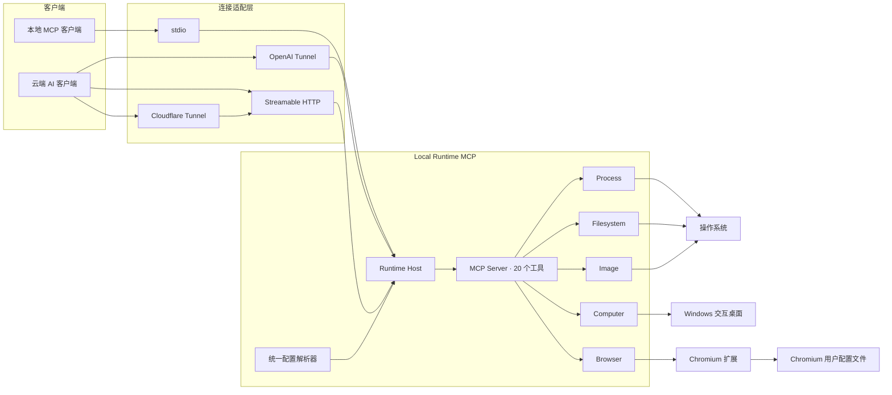
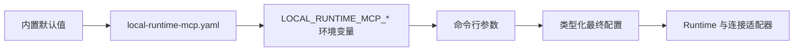
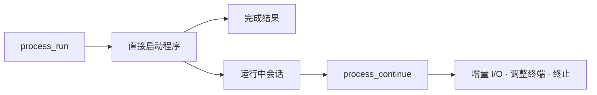
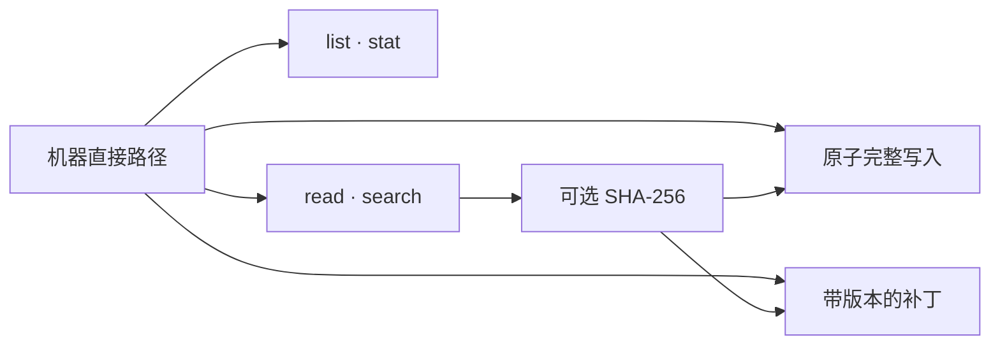
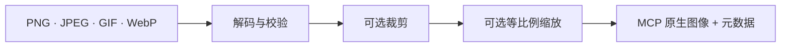
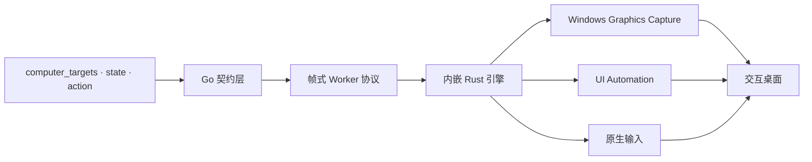
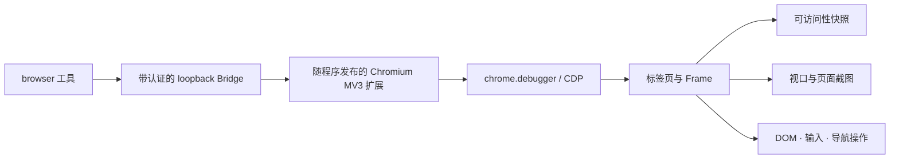

# Local Runtime MCP

[](https://github.com/hicancan/local-runtime-mcp/actions/workflows/ci.yml)
[](https://github.com/hicancan/local-runtime-mcp/releases/latest)
[](LICENSE)

[English](README.md) · **简体中文**

Local Runtime MCP 为 AI 客户端提供一套直接、原生、多模态的机器操作接口。一个便携运行时通过 20 个 MCP 工具覆盖进程、文件、图像、Windows 桌面和 Chromium，同时支持本地 stdio 与远程连接。

Windows 发布包可以放进普通目录或移动存储设备。配置、浏览器扩展、`lrmcp.exe` 与 Cloudflare 配套程序共同组成一个可随身携带的运行目录。

## 核心特点

- **五个正交能力域**：process、filesystem、image、computer、browser。
- **一个运行时，多种连接方式**：stdio、OpenAI Tunnel、Streamable HTTP 与 Cloudflare Tunnel 共享同一套工具和状态语义。
- **原生多模态返回**：图像、浏览器截图和桌面截图直接返回 MCP 图像内容。
- **状态感知交互**：浏览器引用和桌面状态带有版本，操作明确对应生成它们的观察结果。
- **便携配置**：`local-runtime-mcp.yaml` 固定放在可执行文件旁边，可随运行目录迁移到其他机器。
- **跨平台核心**：process、filesystem、image、browser 与连接层支持 Windows、macOS 和 Linux；Windows computer 能力由随程序发布的原生引擎提供。

## 一级架构

系统首先区分“消息怎样到达”和“机器能够做什么”。每种连接方式都会创建同一个 Runtime Host，Runtime Host 对外注册固定的 MCP 工具集合。



### 连接适配层

| 命令 | 连接方式 | 典型场景 |
| --- | --- | --- |
| `lrmcp` | MCP over stdio | 本地 MCP 宿主与开发工具 |
| `lrmcp connect openai` | OpenAI Tunnel | ChatGPT 与 OpenAI 管理的远程会话 |
| `lrmcp serve http` | 监听 loopback 的 Streamable HTTP | 本地反向代理与集成测试 |
| `lrmcp expose cloudflare` | 经托管 Cloudflare Tunnel 暴露 Streamable HTTP | 以稳定公网域名连接当前机器 |

OpenAI 与 Cloudflare 是两种可选择的暴露适配器。运行任意一个命令都会启动同一套本地运行时；命令进程存活期间，机器保持在线。

### Runtime Host

`runtimehost` 统一持有浏览器 Bridge、Computer Controller、进程会话和 MCP Server。连接适配器负责 MCP 消息传输与生命周期。能力域因此可以独立于具体网络服务演进。

### 配置层

所有入口使用同一个解析器和同一条优先级规则：



配置文件固定为 `<lrmcp 所在目录>/local-runtime-mcp.yaml`。命令行参数优先级最高，其次是环境变量、YAML 和内置默认值。每个入口获得的是同一个类型化配置对象，运行目录因此具有完整、可预测的迁移语义。

## 五个能力域

### Process



Process 域通过程序名或可执行文件路径直接启动进程，输入采用明确的参数数组，并支持工作目录、环境变量覆盖、初始 stdin、超时和输出上限。Pipe 模式分别保留 stdout 与 stderr；PTY 模式服务交互式终端程序。持续运行的程序会返回 session ID，后续由 `process_continue` 负责增量读取、输入、PTY 尺寸调整、等待和终止。

### Filesystem



Filesystem 域接受绝对路径，也接受相对于运行时工作目录的路径。读取和搜索均有显式上限；完整写入采用原子提交；补丁要求调用方提供原文件 SHA-256 与唯一上下文锚点，从而为 Agent 编辑建立乐观并发控制。

### Image



Image 域以视觉内容的形式读取视觉文件。`image_read` 校验字节数和像素数上限，支持裁剪与保持比例的缩放，最终返回 MCP 图像以及尺寸、媒体类型和源文件元数据。

### Computer



Windows Computer 域把像素、语义 UI 元素与原生输入合并成一个完整闭环。`computer_targets` 返回经过验证的顶层窗口身份；`computer_state` 捕获桌面或前台目标，并返回 state ID 与数量受限的 UI Automation 引用；`computer_action` 负责激活目标，以及使用坐标或语义引用执行操作。

每次观察得到一个状态纪元。激活窗口和物理输入会推进纪元，后续操作从新的 `computer_state` 继续。Go 层维护公开 MCP 契约；内嵌 Rust Worker 负责 Windows 捕获、UI Automation、DPI 与坐标变换、前台窗口校验和输入路由。

### Browser



Browser 域通过 Chromium 扩展控制用户选择的浏览器配置文件。扩展连接带认证的本机 loopback Bridge，并通过 `chrome.debugger` 使用 Chrome DevTools Protocol 能力。这条链路能够延续该配置文件中的登录会话、标签页、扩展、下载与浏览器权限。

Snapshot 返回主文档与子 Frame 中受限长度的可见文本和带版本的元素引用；Screenshot 返回原生 PNG 与带版本的视口坐标；Action 覆盖点击、拖动、输入、表单值、按键、滚动、选择、复选框、文件上传、对话框和显式 JavaScript 求值。

## MCP 工具表

| 能力域 | MCP 工具 |
| --- | --- |
| Process | `process_run`、`process_continue` |
| Filesystem | `filesystem_list`、`filesystem_stat`、`filesystem_read_text`、`filesystem_search_text`、`filesystem_write_text`、`filesystem_patch_text` |
| Image | `image_read` |
| Computer | `computer_targets`、`computer_state`、`computer_action` |
| Browser | `browser_status`、`browser_tabs`、`browser_open`、`browser_close`、`browser_navigate`、`browser_snapshot`、`browser_screenshot`、`browser_action` |

## 安装

从 [Releases](https://github.com/hicancan/local-runtime-mcp/releases/latest) 下载对应平台的压缩包，解压到一个独立目录。

Windows 发布包结构：

```text
local-runtime-mcp/
├── lrmcp.exe
├── cloudflared.exe
├── config.example.yaml
├── README.md
├── README.zh-CN.md
├── LICENSE
├── THIRD_PARTY_NOTICES.md
└── cloudflared-LICENSE
```

将 `config.example.yaml` 复制为 `local-runtime-mcp.yaml`，填写准备使用的连接和能力配置：

```yaml
browser:
  listen: 127.0.0.1:9315
  token: "至少包含-32-个字符的随机令牌"

openai:
  tunnel_id: "OpenAI-Tunnel-ID"
  api_key: "OpenAI-Tunnel-API-Key"

http:
  listen: 127.0.0.1:9316
  public_host: mcp.example.com
  bearer_token: "至少包含-32-个字符的随机令牌"

cloudflare:
  tunnel_token: "Cloudflare-托管隧道令牌"
```

YAML 文件保存连接凭据，运行目录应由它的操作者妥善保管。

### 安装浏览器扩展

运行：

```powershell
./lrmcp.exe browser-setup
```

该命令会按需生成浏览器令牌，将 YAML 保存在可执行文件旁边，并把扩展释放到同目录的 `browser-extension` 文件夹。打开 `edge://extensions` 或 `chrome://extensions`，启用开发人员模式，选择“加载解压缩的扩展”，然后选中该文件夹。

### 本地 stdio

将 `lrmcp` 作为 MCP Server 进程启动。典型客户端配置如下：

```json
{
  "mcpServers": {
    "local-runtime-mcp": {
      "command": "C:\\Tools\\local-runtime-mcp\\lrmcp.exe"
    }
  }
}
```

### OpenAI Tunnel

在 `openai` 段写入隧道凭据，然后运行：

```powershell
./lrmcp.exe connect openai
```

### Cloudflare Tunnel

创建远程管理的 Cloudflare Tunnel，将域名路由到 `http://127.0.0.1:9316`，在 YAML 中填写公网域名、HTTP bearer token 与隧道 token，然后运行：

```powershell
./lrmcp.exe expose cloudflare
```

发布包包含固定版本的 `cloudflared` 配套程序。公网 MCP 端点为 `https://<public_host>/mcp`，请求使用配置中的 HTTP bearer token 完成认证。

## 环境变量与命令行覆盖

便携 YAML 适合日常运行，自动化场景可以通过以下环境变量覆盖单项：

| 环境变量 | YAML 字段 |
| --- | --- |
| `LOCAL_RUNTIME_MCP_BROWSER_LISTEN` | `browser.listen` |
| `LOCAL_RUNTIME_MCP_BROWSER_TOKEN` | `browser.token` |
| `LOCAL_RUNTIME_MCP_OPENAI_TUNNEL_ID` | `openai.tunnel_id` |
| `LOCAL_RUNTIME_MCP_OPENAI_API_KEY` | `openai.api_key` |
| `LOCAL_RUNTIME_MCP_HTTP_LISTEN` | `http.listen` |
| `LOCAL_RUNTIME_MCP_HTTP_PUBLIC_HOST` | `http.public_host` |
| `LOCAL_RUNTIME_MCP_HTTP_BEARER_TOKEN` | `http.bearer_token` |
| `LOCAL_RUNTIME_MCP_CLOUDFLARE_TUNNEL_TOKEN` | `cloudflare.tunnel_token` |
| `LOCAL_RUNTIME_MCP_CLOUDFLARED` | `cloudflare.binary` |

运行 `lrmcp help` 可以查看对应的命令行参数。

## 构建与测试

构建环境需要 Go 1.27、Node.js 24；Windows Computer 引擎还需要稳定版 Rust MSVC 工具链。

```powershell
npm --prefix browser-extension ci
npm --prefix browser-extension run build
./scripts/build-native.ps1
go test ./...
go vet ./...
go build ./cmd/lrmcp
```

CI 矩阵覆盖 Windows、Linux 与 macOS。Windows CI 同时执行 Chromium 扩展端到端测试，以及 Rust 格式和静态检查。

## 开源协议

Local Runtime MCP 使用 [GNU AGPL v3.0 only](LICENSE)。发布包同时包含独立授权的 `cloudflared` 配套程序，具体归属与协议见 [THIRD_PARTY_NOTICES.md](THIRD_PARTY_NOTICES.md)。
