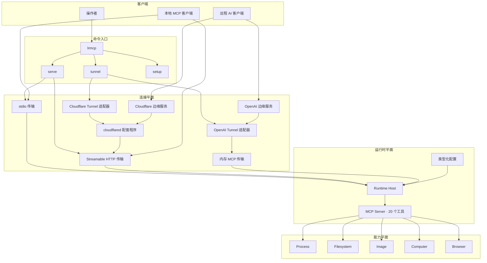
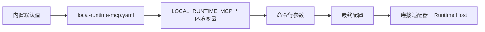
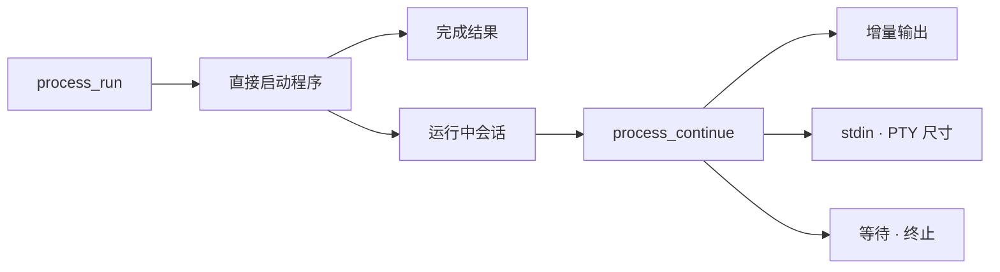
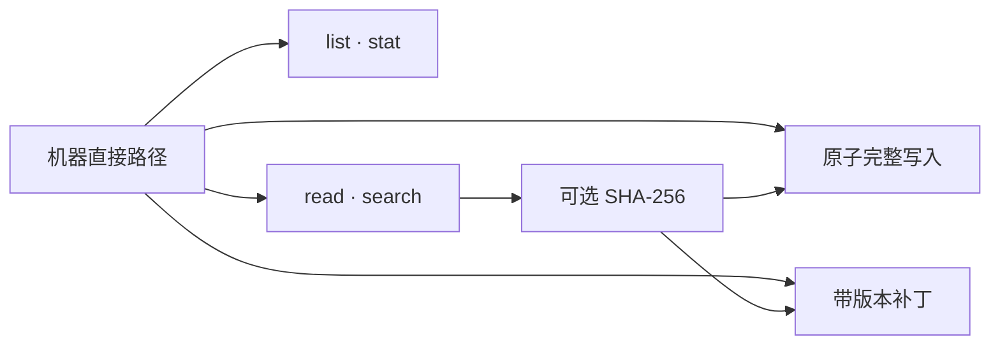
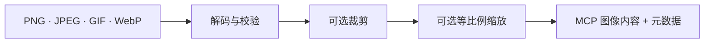
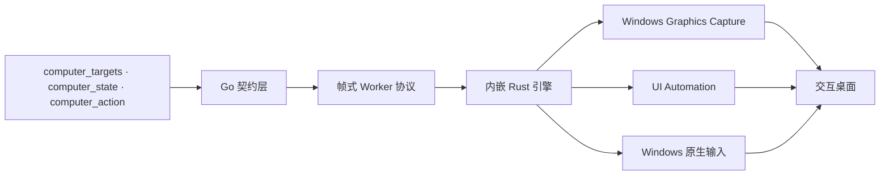
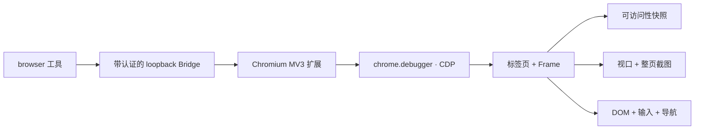

# Local Runtime MCP

[](https://github.com/hicancan/local-runtime-mcp/actions/workflows/ci.yml)
[](https://github.com/hicancan/local-runtime-mcp/releases/latest)
[](LICENSE)

[English](README.md) · **简体中文**

Local Runtime MCP 为 AI 客户端提供运行 `lrmcp` 的机器上的直接、原生、多模态能力。一个便携运行时通过 20 个 MCP 工具覆盖进程、文件、图像、Windows 桌面和 Chromium。

同一套能力服务器可以通过本地 stdio、loopback Streamable HTTP、OpenAI Secure MCP Tunnel 或托管 Cloudflare Tunnel 连接。Windows 发布目录可以放在固定磁盘或移动存储设备中，可执行文件、配置、浏览器集成和隧道配套程序会随目录一起迁移。

## 核心特点

- **五个正交能力域**：process、filesystem、image、computer、browser。
- **一套稳定 MCP 接口**：所有连接方式共享同样的 20 个工具与状态语义。
- **原生多模态结果**：图像、浏览器截图和桌面截图直接返回 MCP 图像内容。
- **状态感知交互**：浏览器引用、截图和桌面观察都有版本，操作明确使用产生目标的观察结果。
- **便携运行**：`local-runtime-mcp.yaml` 固定放在可执行文件旁边，随整个运行目录移动。
- **按职责选择实现语言**：Go 承载 MCP 与机器服务，Rust 实现 Windows Computer 引擎，TypeScript 实现 Chromium 扩展。

## 整体架构

Local Runtime MCP 将两个独立问题分别建模：

1. **MCP 客户端怎样到达这个运行时？**——连接平面。
2. **运行时可以在当前机器上做什么？**——能力平面。

每条命令只选择一种连接方式，然后启动同一个 Runtime Host，发布同一个 MCP Server。



### 命令入口

命令层级与架构语义一一对应：

```text
lrmcp
├── serve
│   ├── stdio
│   └── http
├── tunnel
│   ├── openai
│   └── cloudflare
├── setup
│   └── browser
├── version
└── help
```

| 命令 | MCP 链路 | 身份凭据 | 典型场景 |
| --- | --- | --- | --- |
| `lrmcp serve stdio` | 标准 MCP stdio | 进程环境与主机访问权限 | 本地 MCP 宿主和开发工具 |
| `lrmcp serve http` | loopback 上的标准 MCP Streamable HTTP | 静态 Bearer token | 本地集成和反向代理源站 |
| `lrmcp tunnel openai` | 内嵌 OpenAI Tunnel 适配器与内存 MCP 传输 | OpenAI tunnel ID 与 API key | ChatGPT 和受支持的 OpenAI 客户端 |
| `lrmcp tunnel cloudflare` | `cloudflared` 配套程序连接 loopback Streamable HTTP | Cloudflare tunnel token 与 MCP Bearer token | 由当前机器提供服务的稳定公网域名 |
| `lrmcp setup browser` | 释放并配置 Chromium 扩展 | 自动生成的 loopback Bridge token | 初始化 Browser 能力 |

`serve` 选择标准 MCP 传输，`tunnel` 选择公网可达服务。OpenAI 直接使用其可嵌入的 tunnel client；Cloudflare 使用官方维护的 `cloudflared` 配套程序，并转发到 HTTP 传输。两种适配器采用各自原生的集成方式，同时共享一致的命令结构。

### Runtime Host

Runtime Host 统一持有 Browser Bridge、Computer Controller、进程会话和 MCP Server。连接适配器负责消息到达与进程生命周期。关闭 `lrmcp` 时，选中的连接和机器运行时会一同退出。

### 配置流

所有入口使用同一条优先级规则，最终得到一个类型化配置对象：



配置路径始终为 `<lrmcp 所在目录>/local-runtime-mcp.yaml`。复制整个运行目录后，连接设置和浏览器身份也会随之迁移。

## 能力域

### Process



`process_run` 使用可执行文件和参数数组直接启动程序，支持工作目录、环境变量覆盖、初始 stdin、超时、输出上限，以及 pipe 或 PTY I/O。pipe 与 PTY 会以一致方式通过 `PATH` 解析已安装的程序名。短任务直接返回最终结果，持续任务返回 session ID。`process_continue` 用于读取增量输出、写入输入、关闭 stdin、调整 PTY、等待或终止完整进程树。

### Filesystem



Filesystem 工具接受绝对路径，也接受相对于运行时工作目录的路径。读取、搜索和目录遍历都有明确的结果上限。完整写入采用原子提交。补丁将预期 SHA-256 与唯一上下文 hunk 组合，为 Agent 编辑提供乐观并发控制，同时保留直接机器路径模型。

| 工具 | 操作 |
| --- | --- |
| `filesystem_list` | 有界目录遍历 |
| `filesystem_stat` | 元数据与可选 SHA-256 |
| `filesystem_read_text` | 有界 UTF-8 行范围读取 |
| `filesystem_search_text` | 字面文本或 Go 正则搜索 |
| `filesystem_write_text` | 原子创建或完整替换 |
| `filesystem_patch_text` | 原子、版本校验的上下文补丁 |

### Image



`image_read` 将机器路径转换为原生 MCP 图像内容。它会校验编码大小与像素数量，支持裁剪和等比例缩放，并随图像返回媒体类型、尺寸和源文件元数据。

### Computer



Windows Computer 域将像素、语义 UI 元素和原生输入组成完整的观察—操作闭环：

- `computer_targets` 列出经过验证的顶层窗口身份。
- `computer_state` 捕获桌面或活动目标，返回 state ID 和数量受限的 UI Automation 引用。
- `computer_action` 激活目标，或执行 `move`、`click`、`double_click`、`drag`、`type_text`、`set_value`、`press_key`、`scroll`。

窗口激活和物理输入会推进状态纪元，后续操作从新的 `computer_state` 继续，使坐标和语义引用始终属于生成它们的观察结果。Rust Worker 负责捕获、UI Automation、DPI 与坐标转换、前台校验和输入路由；Go 负责公开 MCP 契约和 Worker 生命周期。

### Browser



Browser 域控制由操作者选择的 Chromium 配置文件。扩展连接带认证的本机 Bridge，通过 `chrome.debugger` 使用 Chrome DevTools Protocol，并延续该配置文件中的登录会话、标签页、下载和浏览器权限。

| 工具 | 操作 |
| --- | --- |
| `browser_status` | Bridge 与扩展连接状态 |
| `browser_tabs` | 列出浏览器标签页 |
| `browser_open` | 打开标签页 |
| `browser_close` | 关闭标签页 |
| `browser_navigate` | URL、后退、前进或刷新 |
| `browser_snapshot` | 跨 Frame 的有界可见文本和带版本元素引用 |
| `browser_screenshot` | 视口、整页或裁剪 PNG 截图 |
| `browser_action` | 点击、双击、悬停、拖动、输入、设置值、按键、滚动、选择、勾选、上传文件、处理对话框或执行 JavaScript |

Snapshot 生成带版本的元素引用，视口截图生成带版本的坐标空间。Action 明确引用其中一次观察，使页面变化之后不会继续复用陈旧目标。

## 工具总表

| 领域 | 工具 | 数量 |
| --- | --- | ---: |
| Process | `process_run`、`process_continue` | 2 |
| Filesystem | `filesystem_list`、`filesystem_stat`、`filesystem_read_text`、`filesystem_search_text`、`filesystem_write_text`、`filesystem_patch_text` | 6 |
| Image | `image_read` | 1 |
| Computer | `computer_targets`、`computer_state`、`computer_action` | 3 |
| Browser | `browser_status`、`browser_tabs`、`browser_open`、`browser_close`、`browser_navigate`、`browser_snapshot`、`browser_screenshot`、`browser_action` | 8 |
| **总计** |  | **20** |

## 安装

从 [Releases](https://github.com/hicancan/local-runtime-mcp/releases/latest) 下载对应平台的压缩包，解压到一个独立目录。

Windows 发布包包含：

```text
local-runtime-mcp/
├── lrmcp.exe
├── cloudflared.exe
├── config.example.yaml
├── README.md
├── README.zh-CN.md
├── LICENSE
├── THIRD_PARTY_NOTICES.md
└── cloudflared-LICENSE
```

将 `config.example.yaml` 复制为 `local-runtime-mcp.yaml`，填写所选连接方式使用的配置段：

```yaml
browser:
  listen: 127.0.0.1:9315
  token: "替换为至少-32-个字符的随机令牌"

openai:
  tunnel_id: "替换为-OpenAI-Tunnel-ID"
  api_key: "替换为-OpenAI-Tunnel-API-Key"

http:
  listen: 127.0.0.1:9316
  public_host: mcp.example.com
  bearer_token: "替换为至少-32-个字符的随机令牌"

cloudflare:
  tunnel_token: "替换为-Cloudflare-托管隧道令牌"
```

配置文件包含连接凭据，应按照其他含凭据的应用目录一样保存和管理整个运行目录。

### 初始化浏览器

运行：

```powershell
./lrmcp.exe setup browser
```

该命令会按需生成浏览器 token，写入同目录的 YAML，并将扩展释放到可执行文件旁边的 `browser-extension`。打开 `edge://extensions` 或 `chrome://extensions`，启用开发人员模式，选择“加载解压缩的扩展”，再选择该目录。

### 本地 stdio

典型 MCP 客户端配置如下：

```json
{
  "mcpServers": {
    "local-runtime-mcp": {
      "command": "C:\\Tools\\local-runtime-mcp\\lrmcp.exe",
      "args": ["serve", "stdio"]
    }
  }
}
```

### OpenAI Tunnel

在 `openai` 段填写隧道凭据，然后运行：

```powershell
./lrmcp.exe tunnel openai
```

隧道创建方法和支持的客户端见 [OpenAI Secure MCP Tunnel 指南](https://developers.openai.com/api/docs/guides/secure-mcp-tunnels)。

### Streamable HTTP

在 `http` 段填写 HTTP Bearer token，然后运行：

```powershell
./lrmcp.exe serve http
```

默认 MCP 端点为 `http://127.0.0.1:9316/mcp`。监听器固定在 loopback，适合作为本机反向代理的源站。

### Cloudflare Tunnel

创建远程管理的 Cloudflare Tunnel，将域名路由到 `http://127.0.0.1:9316`，填写 `http.public_host`、`http.bearer_token` 与 `cloudflare.tunnel_token`，然后运行：

```powershell
./lrmcp.exe tunnel cloudflare
```

发布包包含固定版本的 `cloudflared` 配套程序。公网端点为 `https://<public_host>/mcp`，使用配置中的 HTTP Bearer token 认证。

## 环境变量与命令行覆盖

便携 YAML 适合日常运行，自动化场景可以覆盖单项配置：

| 环境变量 | YAML 字段 |
| --- | --- |
| `LOCAL_RUNTIME_MCP_BROWSER_LISTEN` | `browser.listen` |
| `LOCAL_RUNTIME_MCP_BROWSER_TOKEN` | `browser.token` |
| `LOCAL_RUNTIME_MCP_OPENAI_TUNNEL_ID` | `openai.tunnel_id` |
| `LOCAL_RUNTIME_MCP_OPENAI_API_KEY` | `openai.api_key` |
| `LOCAL_RUNTIME_MCP_HTTP_LISTEN` | `http.listen` |
| `LOCAL_RUNTIME_MCP_HTTP_PUBLIC_HOST` | `http.public_host` |
| `LOCAL_RUNTIME_MCP_HTTP_BEARER_TOKEN` | `http.bearer_token` |
| `LOCAL_RUNTIME_MCP_CLOUDFLARE_TUNNEL_TOKEN` | `cloudflare.tunnel_token` |
| `LOCAL_RUNTIME_MCP_CLOUDFLARED` | `cloudflare.binary` |

运行 `lrmcp help` 可以查看对应的命令行参数。

## 构建与测试

构建环境需要 Go 1.27、Node.js 24；Windows Computer 引擎还需要稳定版 Rust MSVC 工具链。

```powershell
Push-Location browser-extension
npm ci
npm run build
Pop-Location
./scripts/build-native.ps1
go test ./...
go vet ./...
go build ./cmd/lrmcp
```

CI 覆盖 Windows、Linux 与 macOS。Windows CI 还会执行 Chromium 扩展端到端测试，以及 Rust 格式与静态检查。

## 开源协议

Local Runtime MCP 使用 [GNU AGPL v3.0 only](LICENSE)。发布包同时包含独立授权的 `cloudflared` 配套程序，归属与协议详情见 [THIRD_PARTY_NOTICES.md](THIRD_PARTY_NOTICES.md)。
