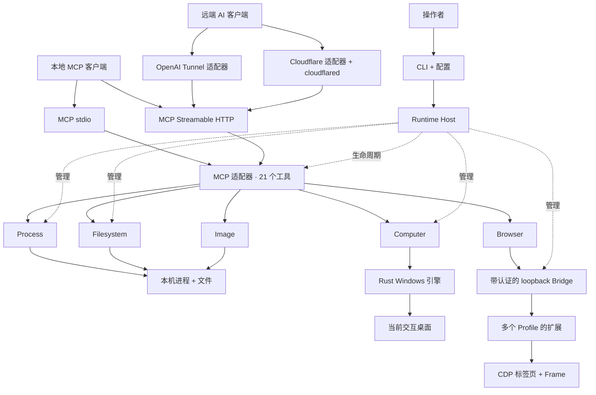
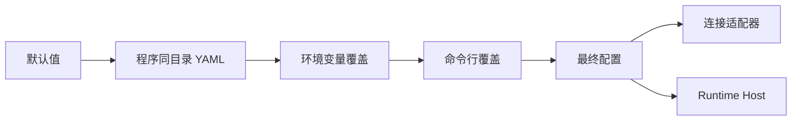
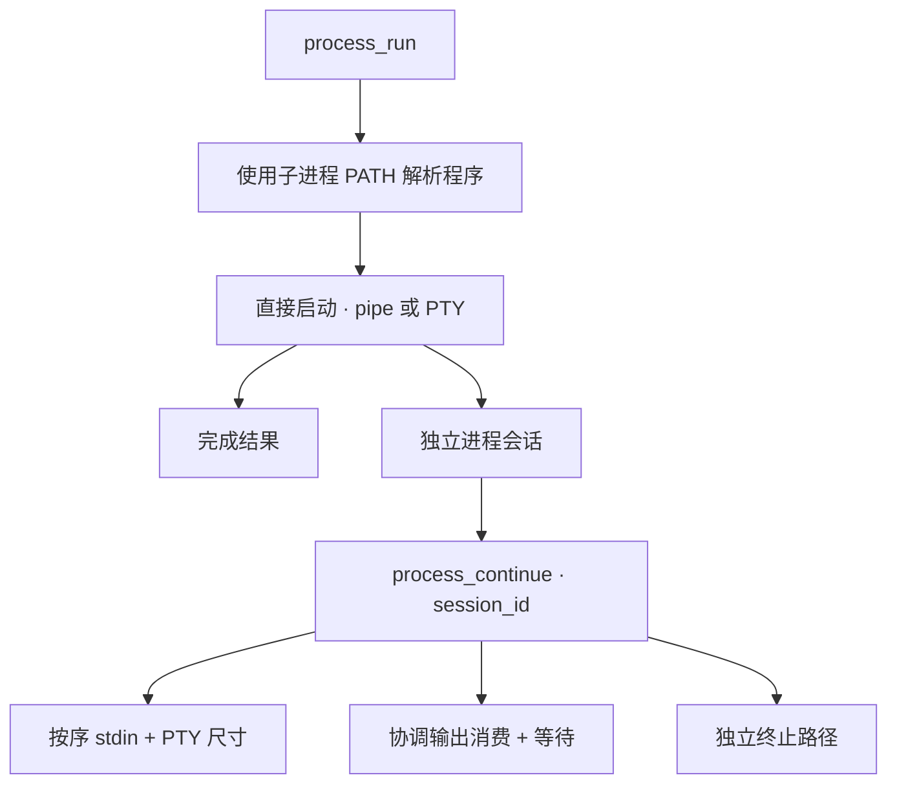
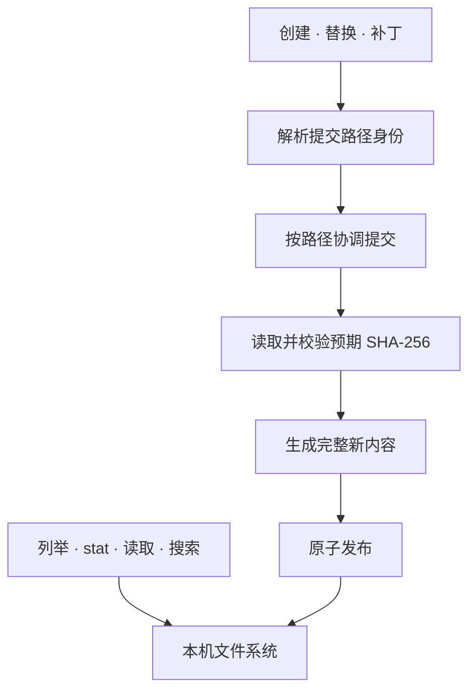
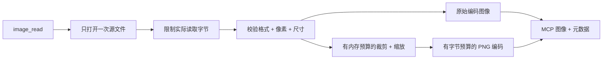
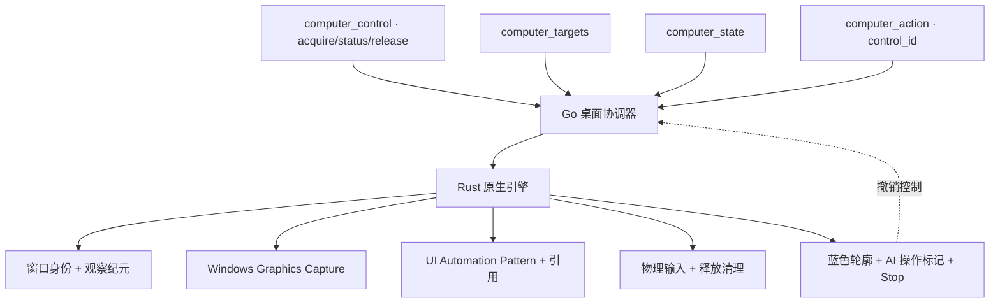
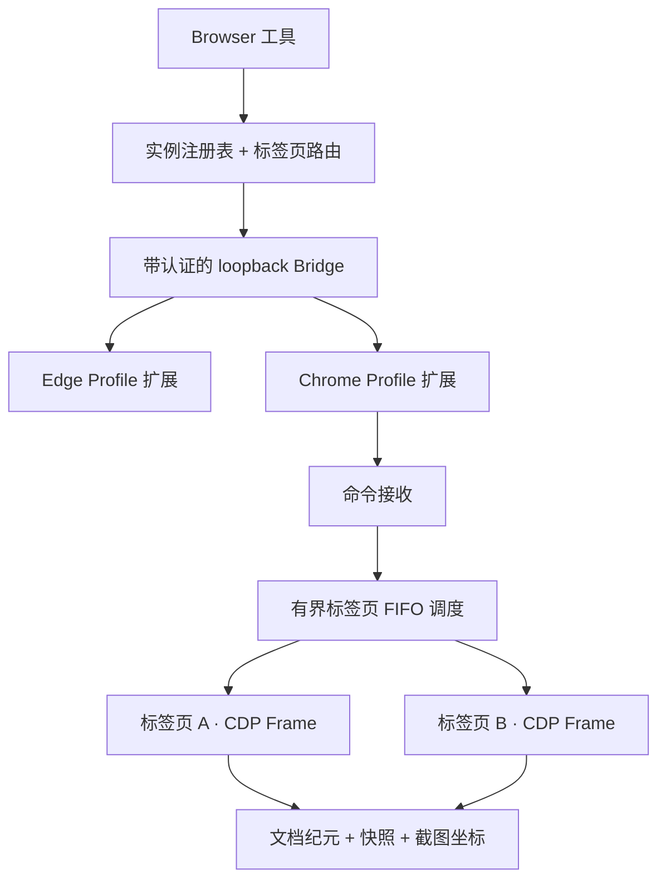

# Local Runtime MCP

[](https://github.com/hicancan/local-runtime-mcp/actions/workflows/ci.yml)
[](https://github.com/hicancan/local-runtime-mcp/releases/latest)
[](LICENSE)
[](https://m8ven.ai/mcp/hicancan/local-runtime-mcp)

[English](README.md) · **简体中文**

让 AI 客户端使用运行 `lrmcp` 的机器上的程序、文件、图像、浏览器配置文件和桌面。Local Runtime MCP 是一个便携的机器访问运行时，以 **21 个 MCP 工具覆盖五个能力域**。

本地客户端可以使用 stdio 或 Streamable HTTP；远端客户端可以通过 OpenAI Secure MCP Tunnel 或 Cloudflare Tunnel 接入。不同进程会话和浏览器标签页可以并发执行，共享文件和桌面输入则按照明确的资源规则协调。

- **原生多模态结果**：文件、网页和桌面观察直接返回文本与 MCP 图像内容。
- **明确的浏览器目标**：连接多个 Chromium Profile，选择有名称的浏览器实例，通过不透明标签页句柄操作。
- **可见的桌面控制**：获取控制权，观察窗口，根据观察操作，最后释放控制权；蓝色提示层和本地 Stop 入口让操作清晰可见。
- **便携配置**：将 `local-runtime-mcp.yaml`、程序和浏览器集成保存在同一目录，支持固定磁盘与移动存储。
- **按平台职责实现**：Go 承载运行时和 MCP 适配器，Rust 实现 Windows 捕获、UI Automation 和输入，TypeScript 实现 Chromium 集成。

## 整体架构

连接层负责请求怎样到达，能力层负责机器上执行什么。一个 Runtime Host 管理当前运行实例中所有客户端共享的资源。


```mermaid
flowchart TB
    Operator[操作者] --> CLI[CLI + 配置]
    CLI --> Host[Runtime Host]
    Local[本地 MCP 客户端] --> Stdio[MCP stdio]
    Local --> HTTP[MCP Streamable HTTP]
    Remote[远端 AI 客户端] --> OpenAI[OpenAI Tunnel 适配器]
    Remote --> Cloudflare[Cloudflare 适配器 + cloudflared]
    OpenAI --> HTTP
    Cloudflare --> HTTP
    Stdio --> MCP[MCP 适配器 · 21 个工具]
    HTTP --> MCP
    MCP --> Process[Process]
    MCP --> Files[Filesystem]
    MCP --> Image[Image]
    MCP --> Computer[Computer]
    MCP --> Browser[Browser]
    Process --> Machine[本机进程 + 文件]
    Files --> Machine
    Image --> Machine
    Computer --> Native[Rust Windows 引擎]
    Native --> Desktop[当前交互桌面]
    Browser --> Bridge[带认证的 loopback Bridge]
    Bridge --> Profiles[多个 Profile 的扩展]
    Profiles --> CDP[CDP 标签页 + Frame]
    Host -. 生命周期 .-> MCP
    Host -. 管理 .-> Process
    Host -. 管理 .-> Files
    Host -. 管理 .-> Computer
    Host -. 管理 .-> Bridge
```

实线表示请求链路，虚线表示资源生命周期归属。文本和图像是 MCP 内容类型，由选定的传输方式一起承载。

| 层 | 职责 |
| --- | --- |
| CLI 与配置 | 选择连接模式，一次性解析配置。 |
| 连接适配器 | 通过 stdio、HTTP 或 Tunnel Provider 递送请求。 |
| MCP 适配器 | 发布工具 schema、验证参数、编码结果。 |
| 能力服务 | 定义资源身份、观察、操作与并发规则。 |
| 平台后端 | 执行操作系统调用、Windows 原生交互和 Chromium CDP 命令。 |

Host 创建 Process Manager、Filesystem Service、Browser Bridge 和 Computer Controller。退出时停止接收工作，取消待执行请求，清理受管进程与注入输入，关闭连接及配套程序。单次请求失败后，Host 和其他资源继续运行。

### 命令与传输

```text
lrmcp
├── serve
│   ├── stdio
│   └── http
├── tunnel
│   ├── openai
│   └── cloudflare
├── setup
│   └── browser
├── version
└── help
```

每次运行选择一种连接模式。七条命令路径分别负责连接启动、浏览器准备和程序信息。

| 命令 | 链路与凭据 |
| --- | --- |
| `lrmcp serve stdio` | 标准 MCP 进程管道，由父进程提供访问权限。 |
| `lrmcp serve http` | loopback Streamable HTTP，使用配置的 Bearer token。 |
| `lrmcp tunnel openai` | 官方 HTTP forwarding 连接私有 loopback MCP 端点，配置 Tunnel ID 与 API key。 |
| `lrmcp tunnel cloudflare` | 官方 `cloudflared` 连接 loopback HTTP，配置 Cloudflare Tunnel token 与 MCP Bearer token。 |
| `lrmcp setup browser` | 生成 Bridge 凭据，释放和配置扩展。 |
| `lrmcp version` | 输出可执行文件版本。 |
| `lrmcp help` | 显示命令与参数。 |

OpenAI 适配器使用动态分配的本机端口和运行时生成、保存在内存中的私有链路凭据。官方转发客户端通过标准 HTTP 连接共享 MCP Server。Cloudflare 使用配置中的 loopback 源站及官方维护的配套程序。两种 Provider 共享能力实现。

### 配置


```mermaid
flowchart LR
    Defaults[默认值] --> YAML[程序同目录 YAML]
    YAML --> Environment[环境变量覆盖]
    Environment --> Flags[命令行覆盖]
    Flags --> Config[最终配置]
    Config --> Connection[连接适配器]
    Config --> Host[Runtime Host]
```

优先级为 **命令行 > 环境变量 > YAML > 默认值**。配置固定读取 `<lrmcp 所在目录>/local-runtime-mcp.yaml`。浏览器实例身份保存在各 Profile 的扩展存储中；进程、标签页和桌面观察句柄由当前资源生命周期管理。

## 五个能力域

| 领域 | 工具数量 |
| --- | ---: |
| Process | 2 |
| Filesystem | 6 |
| Image | 1 |
| Computer | 4 |
| Browser | 8 |
| **总计** | **21** |

### Process · 2 个工具


```mermaid
flowchart TB
    Run[process_run] --> Resolve[使用子进程 PATH 解析程序]
    Resolve --> Launch[直接启动 · pipe 或 PTY]
    Launch --> Final[完成结果]
    Launch --> Sessions[独立进程会话]
    Sessions --> Continue[process_continue · session_id]
    Continue --> Input[按序 stdin + PTY 尺寸]
    Continue --> Output[协调输出消费 + 等待]
    Continue --> Stop[独立终止路径]
```

- `process_run` 接收程序名、参数数组、工作目录、环境变量覆盖、初始 stdin、执行期限、输出上限和 pipe/PTY I/O 模式。
- `process_continue` 读取增量输出、写入 stdin、关闭 pipe 输入、调整 PTY 尺寸、等待或终止受管会话。

pipe 和 PTY 都使用合并后的子进程 `PATH` 查找程序，Windows 还使用 `PATHEXT`。显式相对程序路径以请求的工作目录为基准。需要 shell 语法时，明确启动所需 shell 并传入参数。

不同会话并行运行。同一会话的输入按序写入，一次结果同时消费 stdout 与 stderr。等待输出不会阻塞终止路径，stdin 写入堵塞时也能终止。输出和输入等待有容量上限，单次 stdin 最大为 16 MiB。

`process_run` 交付运行中会话之前被取消，会终止并回收该进程。取消 `process_continue` 只结束本次等待；结束会话使用 `terminate=true`。进程执行期限与 Host 退出独立于单次 MCP 请求期限。

### Filesystem · 6 个工具


```mermaid
flowchart TB
    Read[列举 · stat · 读取 · 搜索] --> Files[本机文件系统]
    Write[创建 · 替换 · 补丁] --> Path[解析提交路径身份]
    Path --> Lock[按路径协调提交]
    Lock --> Version[读取并校验预期 SHA-256]
    Version --> Build[生成完整新内容]
    Build --> Commit[原子发布]
    Commit --> Files
```

| 工具 | 操作 |
| --- | --- |
| `filesystem_list` | 有界目录遍历。 |
| `filesystem_stat` | 元数据与可选 SHA-256。 |
| `filesystem_read_text` | 按行范围读取 UTF-8，设置行数与字节上限。 |
| `filesystem_search_text` | 字面文本或 Go 正则搜索。 |
| `filesystem_write_text` | 明确选择 `mode=create` 或 `mode=replace`。 |
| `filesystem_patch_text` | 带版本校验、唯一上下文锚点的补丁。 |

`create` 在目标不存在时发布完整文件；`replace` 要求文件已存在，并提供 `expected_sha256`。Patch 同样要求预期 hash，所有 hunk 都基于同一个不可变原始版本定位。

文本读取返回完整行。第一条目标行超过字节预算时返回有界错误；已经读取完整行后遇到超限则报告截断和下一行号。跳过的行使用固定内存扫描，需要 SHA-256 时通过流式读取计算整个文件的 hash。

Filesystem Service 从版本校验到提交全程持有对应路径的锁。不同路径与读操作可并行。修改拒绝最终路径上的符号链接，并规范化已有父目录的别名以协调提交。

这些锁协调本 Host 发出的文件调用。外部编辑器和被启动的程序按各自规则访问文件系统。并发编码任务可以使用不同 Git worktree，分开索引和构建输出。

### Image · 1 个工具


```mermaid
flowchart LR
    Read[image_read] --> Open[只打开一次源文件]
    Open --> Bytes[限制实际读取字节]
    Bytes --> Header[校验格式 + 像素 + 尺寸]
    Header --> Original[原始编码图像]
    Header --> Transform[有内存预算的裁剪 + 缩放]
    Transform --> Encode[有字节预算的 PNG 编码]
    Original --> Result[MCP 图像 + 元数据]
    Encode --> Result
```

`image_read` 支持 PNG、JPEG、GIF 和 WebP，返回原生 MCP 图像内容及实际源文件字节数和尺寸。可选裁剪与等比例缩放输出 PNG。编码输入、像素、尺寸、解码变换内存和输出编码都有上限，等待执行容量时可以取消。

Image 是无状态读取。Browser 与 Computer 截图各自保留对应的观察身份和坐标语义。

### Computer · 4 个工具


```mermaid
flowchart TB
    Control[computer_control · acquire/status/release] --> Coordinator[Go 桌面协调器]
    Targets[computer_targets] --> Coordinator
    State[computer_state] --> Coordinator
    Action[computer_action · control_id] --> Coordinator
    Coordinator --> Worker[Rust 原生引擎]
    Worker --> Identity[窗口身份 + 观察纪元]
    Worker --> Capture[Windows Graphics Capture]
    Worker --> UIA[UI Automation Pattern + 引用]
    Worker --> Input[物理输入 + 释放清理]
    Worker --> Overlay[蓝色轮廓 + AI 操作标记 + Stop]
    Overlay -. 撤销控制 .-> Coordinator
```

Windows 当前交互桌面共享一个前台、鼠标和键盘输入流。`computer_control` 将这个输入资源分配给一个工作流：

```text
computer_control(kind="acquire", label="更新文档") → control_id
computer_targets() → target_id
computer_action(kind="activate", control_id=..., target_id=...)
computer_state(control_id=..., target_id=...) → 可行动的 state_id
computer_action(kind="click", control_id=..., state_id=..., element_ref=...)
computer_state(control_id=..., target_id=...) → 新的 state_id
computer_control(kind="release", control_id=...)
```

- `computer_control` 获取控制权、查询占用状态或使用匹配 token 释放。状态显示任务名称与占用情况，控制 token 由获取者保管。
- `computer_targets` 列出经过验证的顶层窗口。
- `computer_state` 返回像素和有界 UI Automation 信息。不传控制 token 时是 `actionable=false` 的只读观察，state ID 为空，元素只提供描述；有效 token 将可行动引用与 state ID 绑定到当前控制代次和前台目标。
- `computer_action` 支持 `activate`、`move`、`click`、`double_click`、`drag`、`type_text`、`set_value`、`press_key`、`scroll`。全部动作需要 `control_id`；基于观察的动作需要准确匹配的可行动 `state_id`。

控制权默认五分钟空闲到期，受控操作自动刷新期限。释放、到期、本地 Stop 与退出会取消待执行工作，清理注入输入，失效旧的可行动观察。其他工作流尝试获取时收到 desktop busy。

已提交操作或输入清理仍在完成时，控制状态保持 `stopping`。已经提交的原生或 UIA 操作在取消后可能结果不确定，应先检查目标再决定是否重复执行。

Rust 引擎统一负责 Windows 捕获、窗口身份、DPI 坐标、UIA 引用、输入路由与提示层。语义 `set_value` 使用目标支持的 UI Automation ValuePattern。`uia_status` 返回可用、截断或提供程序错误。像素与 UIA 反映持续变化的界面，每次动作之后都应重新观察，包括已经产生部分副作用的失败。

蓝色目标轮廓和 AI 位置标记显示当前交互。点击本地 Stop 条可以撤销控制。提示层从反馈截图中排除。物理动作使用系统输入流，真正独立的桌面任务可以使用不同交互机器或环境。

### Browser · 8 个工具


```mermaid
flowchart TB
    Tools[Browser 工具] --> Registry[实例注册表 + 标签页路由]
    Registry --> Bridge[带认证的 loopback Bridge]
    Bridge --> Edge[Edge Profile 扩展]
    Bridge --> Chrome[Chrome Profile 扩展]
    Chrome --> Intake[命令接收]
    Intake --> Queue[有界标签页 FIFO 调度]
    Queue --> TabA[标签页 A · CDP Frame]
    Queue --> TabB[标签页 B · CDP Frame]
    TabA --> Observation[文档纪元 + 快照 + 截图坐标]
    TabB --> Observation
```

在每个用于 AI 操作的 Chromium Profile 中加载同一套 MV3 扩展，在扩展选项中填写容易识别的名称，例如 `Edge · 工作`、`Chrome · 研究`。扩展在该 Profile 中保存稳定 UUID，用 Bridge token 连接共享运行时。`chrome.debugger` 将 CDP 操作发送到明确的标签页和 Frame。

| 工具 | 目标与操作 |
| --- | --- |
| `browser_status` | 列出有名称的实例及连接状态。 |
| `browser_tabs` | 指定 `browser_id`，发现标签页。 |
| `browser_open` | 指定 `browser_id`，创建标签页，默认 `active=false`。 |
| `browser_close` | 关闭不透明 `tab_id`。 |
| `browser_navigate` | 对 `tab_id` 导航、后退、前进或刷新。 |
| `browser_snapshot` | 跨 Frame 的有界可访问性文本和带版本元素引用。 |
| `browser_screenshot` | 对 `tab_id` 获取视口、整页或裁剪 PNG。 |
| `browser_action` | 使用引用或截图坐标操作，并支持表单、文件、对话框和 JavaScript。 |

从状态结果复制 `browser_id`，从发现或创建结果复制不透明标签页 `id`，在后续调用中作为 `tab_id` 使用。句柄内部包含实例和生命周期身份。目标不存在或离线时返回错误，保持所选 Profile 的边界。扩展 Worker 重启或连接代次变化后，重新发现标签页、获取观察。

动作包括 `click`、`double_click`、`hover`、`drag`、`type_text`、`set_value`、`press_key`、`scroll`、`select`、`check`、`upload_files`、`handle_dialog`、`evaluate`。视口坐标需要匹配的截图 ID；元素引用属于观察时的文档和 Frame 代次。导航、Frame 变化、重连与副作用会失效对应观察。

不同实例与标签页可并行，同一个标签页按序执行。等待容量与执行槽有界，被取消的排队命令会丢弃。不同 Profile 保留各自浏览器数据，同一 Profile 的标签页共享其会话、cookie 和账户。

改变当前可见桌面的 Browser 操作会与 Computer 控制权协调。后台标签页工作继续并行；可见操作遇到已占用桌面时，携带匹配的 `control_id`，或等待控制权释放。

## 并发工作流

| 资源 | 协调规则 |
| --- | --- |
| Process | 会话独立；每个会话按序输入、协调消费输出。 |
| Filesystem | 读取与不同路径并行；同路径按版本校验后提交。 |
| Image | 在执行容量和内存预算内独立读取。 |
| Browser | 明确实例和标签页路由；不同标签页并行，单标签页 FIFO。 |
| Computer | 一个桌面输入控制者；只读观察仍可用。 |

两个 AI 会话可以各自选择一个浏览器实例，打开自己的后台标签页，也可以同时运行独立进程；其中一个工作流使用桌面输入。如果选择同一个标签页、文件、仓库或云端账户，它们就共享对应资源。

请求取消、进程执行期限和 Host 退出分别处理。一个失败或到期调用保留其他资源。动作可能已经产生副作用时，先观察目标，再决定是否重试非幂等操作。

## 安装

从 [Releases](https://github.com/hicancan/local-runtime-mcp/releases/latest) 下载平台压缩包，校验公布的 SHA-256，解压到独立目录。

| 平台 | Process、Filesystem、Image | Browser | Computer |
| --- | --- | --- | --- |
| Windows amd64 | 支持 | Chromium 扩展 | Windows 原生引擎 |
| Linux / macOS | 支持 | 桌面浏览器中的 Chromium 扩展 | 返回平台不可用 |

Browser 需要正在运行并加载扩展的 Chromium Profile。Windows Computer 需要 Windows 10 2004 或更新版本（包括 Windows 11）、交互桌面，以及适合目标应用的账户权限。

Windows 发布包包含：

```text
local-runtime-mcp/
├── lrmcp.exe
├── cloudflared.exe
├── config.example.yaml
├── README.md
├── README.zh-CN.md
├── SECURITY.md
├── PRIVACY.md
├── LICENSE
├── THIRD_PARTY_NOTICES.md
├── licenses/
└── cloudflared-LICENSE
```

将 `config.example.yaml` 复制为 `local-runtime-mcp.yaml`，填写当前连接方式所需配置：

```yaml
browser:
  listen: 127.0.0.1:9315
  token: "replace-with-a-random-token-of-at-least-32-characters"

openai:
  tunnel_id: "replace-with-your-openai-tunnel-id"
  api_key: "replace-with-your-openai-tunnel-api-key"

http:
  listen: 127.0.0.1:9316
  public_host: mcp.example.com
  bearer_token: "replace-with-a-random-token-of-at-least-32-characters"

cloudflare:
  tunnel_token: "replace-with-your-cloudflare-managed-tunnel-token"
```

按照含凭据应用目录的要求保护整个运行目录。移动运行目录时，浏览器安装、实例身份和账户数据仍属于原机器上的 Profile。

### 浏览器准备

```powershell
./lrmcp.exe setup browser
```

命令将 Bridge 凭据保存在同目录 YAML，并把扩展释放到可执行文件旁边的 `browser-extension`。在每个目标 Profile 中打开 `edge://extensions` 或 `chrome://extensions`，启用开发人员模式，选择“加载解压缩的扩展”，再选择该目录。打开扩展选项设置独立名称，确认 Bridge 地址与 token。启动 `lrmcp` 后通过 `browser_status` 查看连接中的实例。

### 本地 stdio

```json
{
  "mcpServers": {
    "local-runtime-mcp": {
      "command": "C:\\Tools\\local-runtime-mcp\\lrmcp.exe",
      "args": ["serve", "stdio"]
    }
  }
}
```

### OpenAI Tunnel

填写 `openai` 段后运行：

```powershell
./lrmcp.exe tunnel openai
```

Provider 设置和受支持的客户端见 [OpenAI Secure MCP Tunnel 指南](https://developers.openai.com/api/docs/guides/secure-mcp-tunnels)。私有 HTTP 源站自动创建，端口与私有链路凭据只在本次运行中保留。

### Streamable HTTP

填写 `http.bearer_token` 后运行：

```powershell
./lrmcp.exe serve http
```

默认端点为 `http://127.0.0.1:9316/mcp`。loopback 监听器使用配置的 Bearer token，也可以作为反向代理源站。

### Cloudflare Tunnel

创建远程管理的 Cloudflare Tunnel，将域名路由到 `http://127.0.0.1:9316`，填写 `http.public_host`、`http.bearer_token` 和 `cloudflare.tunnel_token` 后运行：

```powershell
./lrmcp.exe tunnel cloudflare
```

发布包附带固定版本的 `cloudflared`。远端 MCP 客户端使用 `https://<public_host>/mcp` 与 MCP Bearer token。Cloudflare token 验证隧道程序，MCP token 验证工具客户端。

### 环境变量覆盖

| 环境变量 | YAML 字段 |
| --- | --- |
| `LOCAL_RUNTIME_MCP_BROWSER_LISTEN` | `browser.listen` |
| `LOCAL_RUNTIME_MCP_BROWSER_TOKEN` | `browser.token` |
| `LOCAL_RUNTIME_MCP_OPENAI_TUNNEL_ID` | `openai.tunnel_id` |
| `LOCAL_RUNTIME_MCP_OPENAI_API_KEY` | `openai.api_key` |
| `LOCAL_RUNTIME_MCP_HTTP_LISTEN` | `http.listen` |
| `LOCAL_RUNTIME_MCP_HTTP_PUBLIC_HOST` | `http.public_host` |
| `LOCAL_RUNTIME_MCP_HTTP_BEARER_TOKEN` | `http.bearer_token` |
| `LOCAL_RUNTIME_MCP_CLOUDFLARE_TUNNEL_TOKEN` | `cloudflare.tunnel_token` |
| `LOCAL_RUNTIME_MCP_CLOUDFLARED` | `cloudflare.binary` |

运行 `lrmcp help` 查看对应命令行参数。

## 构建与测试

需要 Go 1.27、Node.js 24。Windows Computer 引擎使用 Rust 1.96.0 MSVC 工具链，CI 与发布构建固定使用 Rust 1.96.0，Windows 原生 Worker 静态链接 Microsoft CRT。原生构建前加载 Visual Studio 构建环境。

```powershell
Push-Location browser-extension
npm ci
npm run build
npm test
Pop-Location
./scripts/build-native.ps1
cargo fmt --manifest-path native/computer-windows/Cargo.toml --check
cargo clippy --manifest-path native/computer-windows/Cargo.toml --all-targets -- -D warnings
cargo test --manifest-path native/computer-windows/Cargo.toml --locked
go test ./...
go vet ./...
go build ./cmd/lrmcp
```

Go 测试覆盖资源生命周期、响应归属、取消、文件竞争提交、进程 I/O 和浏览器身份路由。扩展调度测试覆盖顺序、公平性、取消和队列上限。Windows 可选 Chromium 验收会在临时 Profile 中加载真实扩展：

```powershell
$env:LOCAL_RUNTIME_MCP_BROWSER_E2E = '1'
go test ./internal/browser -run TestEdgeExtensionEndToEnd -count=3 -v
```

CI 覆盖 Windows、Linux 和 macOS。本地协议与浏览器测试验证对应执行链路；真实 ChatGPT 多会话验收针对已配置的客户端和 Tunnel 单独进行。

## 安全、隐私与协议

通过认证的客户端使用运行 `lrmcp` 的账户权限。资源句柄在共享机器内部协调目标与工作流。需要工作负载分离时，使用专用操作系统账户与浏览器 Profile。

[SECURITY.md](SECURITY.md) 说明部署与私密漏洞报告；[PRIVACY.md](PRIVACY.md) 说明本地保留和外部 Provider 数据流。

项目使用 [GNU AGPL v3.0 only](LICENSE)。`cloudflared` 配套程序使用独立协议，依赖归属见 [THIRD_PARTY_NOTICES.md](THIRD_PARTY_NOTICES.md)。
